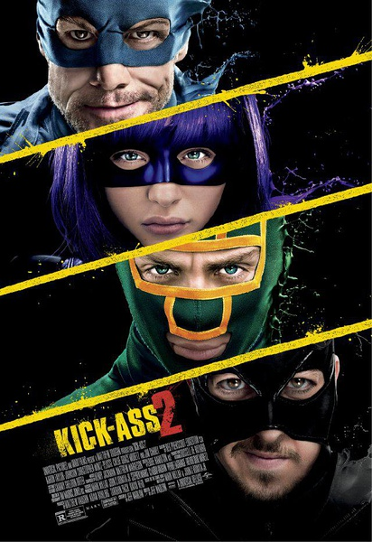
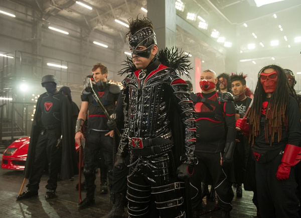
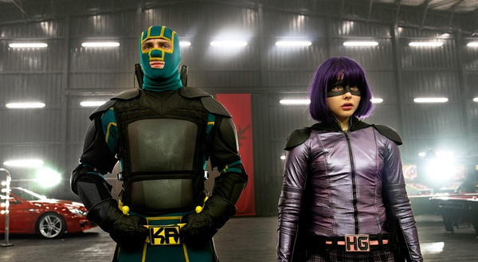

《海扁王2 KickAss2》

			

老公的评论：
 
　　说心里话，我并不喜欢这部电影，能够看完，只是对于前作的一种延续。
 
　　就像对待《古惑仔：江湖新秩序》一样，我是不喜欢影片中有太多的脏话的，这样只会减。
 
　　《海扁王2》中的角色的年纪在增加，但是做的事情似乎更幼稚起来了。片中Hit
Girl去见一堆女伴的场景让增加了更多对美国的反感，要是社会真的变成了这样，有多少家长还会放心自己的孩子和朋友一起玩儿呢？
 

　　金·凯利已经变了，变得几乎认不出，不像那个神奇的他了；让我振奋了一下的事情是主人公在学校的女友居然是《Nikita》里面的Alex，她还真是越活越年轻了。
 
　　听说这部电影还有下一篇，但是我已经准备放弃了。

老婆的评论：

　　说实话，这部电影没有第一部有意思，整个看来下，只有一般的感觉。
 
　　第二部的超杀女长大了，没有那种小萝莉的感觉，好像少了点什么。
 
　　正义的和邪恶的这两派也真有点傻，这次真是为了做戏而戏了，动机都有点幼稚，而所谓的战争也好像失去了焦点，真的有点愣。
 
　　这种影片的好处虽有牺牲，正义终将战胜邪恶，结局总是好的。

上映年份　2013							
		
http://blog.sina.com.cn/s/blog_52187ba90101e03d.html
