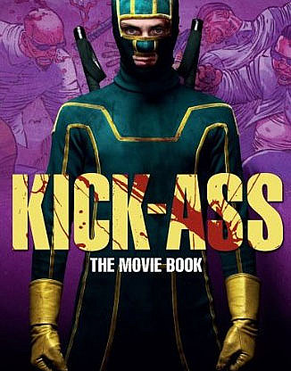
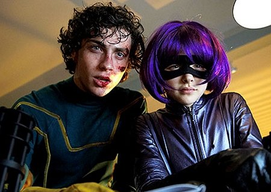
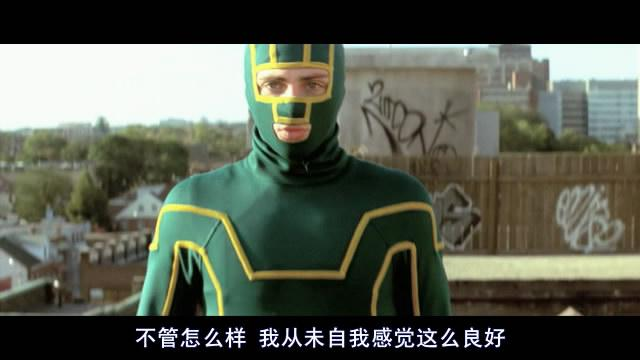

《海扁王 Kick Ass》

			【夫妻影评】《海扁王 Kick Ass》

老公的评论：
 
　　尽管“二师兄”一再推荐，但我依旧没有觉得这部电影有“那么”好看，我想，是因为他处在恋爱中心情好吧。
 

　　在我的心目中，这部电影虽然没有达到顶级的标准，但并不是说它不可看。特别是本片的片头，那个从高楼上坠下的“超人”，太经典了，这个桥段相信会在未来的很多文艺作品当中出现。
 

　　至于我不喜欢这部电影的地方，主要是我觉得不该让一个小朋友角色参与那么多的杀戮，即使杀的是所谓的恶人，但手段也有些过于血腥了。
 
　　凯奇在这部片子中没有什么特别出色的亮点，看来他是甘当绿叶了。
 
　　这就是我对这部片子的感觉，其他真的让我不是很看的进去，才没过几天，很多情节我就已经记不住了。这种快餐文化真可怕。
 

　　可为什么“二师兄”会非常推崇这部电影呢，我想一定是因为他的女朋友也是个“小朋友”吧，或者从心理学的角度，可能很多的人在不同的心境下，对待相同的事物会有这截然不同的看法。
 
　　最近事情很多，很杂，要努力，要赚钱，要做好我的图书分类，要写出好的小说……
 

 
老婆的评论：
 

　　是一部改编漫画的影片，讲述的是一个男孩戴夫想成才超级英雄的故事，在这一过程中以海扁王自称，认识了大老爹及其女儿明迪。而戴夫无意中又成了毒枭们的眼中钉。
 

　　大毒枭们要想办法杀死海扁王，可街头随时能遇到装扮成海扁王的人，真正的海扁王是谁？大毒枭头都大了，其儿子想出一个办法他扮演成另一个超级英雄“红雾”来引诱海扁王，这个方法很快起到作用了，在抓捕海扁王时，才发现真正打击毒枭们的英雄其实另有其人，海扁王又被利用了，他引出了大老爹及明迪，导致大老爹的死亡，明迪把海扁王救出来。共同杀进了大毒枭的大本营，获得了最后的胜利。
 

　　影片节奏还可以，就是觉得海扁王特面，与以往的这些英雄形象实在有点差距，而明迪给人留下了深刻的印象，一个小不点，装上一箱子的武器，去杀死毒枭们，这种形象只能在动画片中出现了。
 
　　凯奇在这部影片中发挥的正常而已，他的镜头并不是很多。
 
　　总的来说这部电影挺一般的，看个热闹吧。
　　

上映年份2010
 
导演
Matthew Vaughn
 
主要演员Kick-Ass……Aaron
Johnson
Hit-Girl……Chloe Moretz
Red Mist……Christopher Mintz-Plasse
Big Daddy……Nicolas Cage							
		
http://blog.sina.com.cn/s/blog_52187ba90100kg90.html
