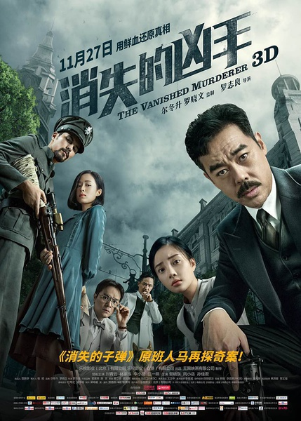
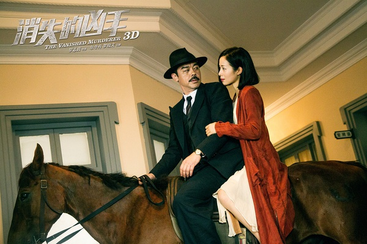
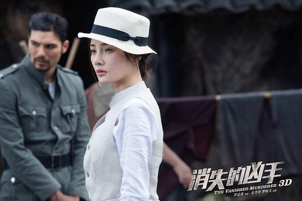

《消失的凶手》

			

老公的评论：

　　因为几乎是在两周之内看的《消失的子弹》与《消失的凶手》，没法不把这两部电影做一个比较，整体来说，《消失的凶手》也算死可看，但是比《消失的子弹》差了不少，很不少。

　　首先，松东路来处理这个案子就显得有些莫名其妙，他到底是一个真正的执法者？还是一个我行我素的私家侦探？如果秉公办事的话，他应当在第一时间就把傅源带回香城，而不是惹下那么多的麻烦。

　　其次，常胜在这部电影之中是个可有可无的角色，她的出现并没有为主题添彩或者增加一些什么，反而淡化了主题，找到炸弹的那一幕其实完全可以换一个其他的表现方法，这种角色算鸡肋都有点勉强；很像是为了出现而出现的，这一点上弱于《消失的子弹》中的小云雀或者傅源。

　　再次，故事的很多情节交代的并不充分，比如林家栋饰演的霍教授是怎么知道那些黄金的事情的？难道他的学生是他的同谋？这些学生和警察难道都是为了黄金在做这些事情？

　　最后，傅源为什么要求死呢？逻辑啊！说到死，那些被逼跳楼的人要么跳要么被枪打死，都是死，那么他们为什么还要跳呢？如果像松东路说的，确实有不跳的人，那么没有人听到枪声吗？

　　能看的电影，我想，应该还有哪个马术俱乐部赞助了吧……

老婆的评论：

　　故事又发生在和上部《消失的子弹》那个年代，主人公松东路（刘青云饰）应傅源（江一燕饰）的邀请来到香城，这个城市因为傅源的复仇又将变得如何？我觉得这个与上一部电影又太多相似的地方，在我看来，虽然是系列故事，但也不需要如此的相似。

　　我知道自杀者的推动者是教授（林家栋饰），但没想到他比我想的要坏，做这一切并不是为了所谓的公义，只是为了那批黄金而已。

　　但我同样不喜欢，自杀的推手还有一个警察。

　　我要赞一下傅源这个角色设计的多厉害，她杀了老公可以逃脱又自首，为了去复仇又成功逃狱，还能让松东路对她有好感。

　　李小璐在这部电影里就是一个花瓶式的角色，可有可无。

上映年份　2015							
		
http://blog.sina.com.cn/s/blog_52187ba90102wgyz.html
