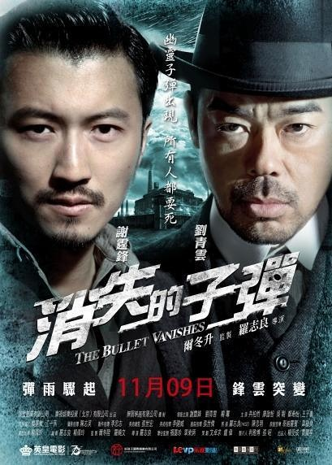
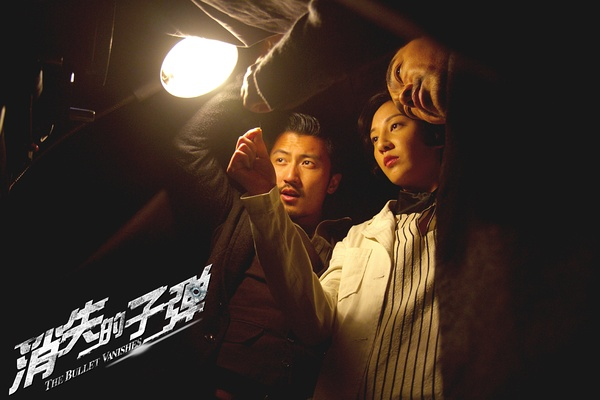

《消失的子弹》

			

老公的评论：

　　一部很好看的电影，除了结尾为了悬疑而悬疑之外，其他部分很精彩。

　　在我看来，这部电影甚至可以算是烂尾——其实完全可以把这部电影做的再格调高一些：王海为什么不能是一个除暴安良的侠士；郭追为什么不能有伸张正义的机会，为什么不能和松东路一起为天城县的治安贡献力量？

　　兵工厂的老板是个典型的反派，廖启智也演的很棒，这样一个角色，为什么不能被杀死呢？

　　在影片的最后，谢霆锋饰演的郭追为什么要自杀呢？他的理想呢？正所谓一将功成万骨枯，争夺局长的位子是政治斗争，有人牺牲是在所难免的，更何况死的那些人要不是真正的坏人，要不就是麻木不仁的人……

　　港片拍成这样，真的很棒，强力推荐的一部好电影，可惜看晚了！影片中江一燕所饰演女囚的案子也很有趣……，高智商其实真的也是一种性感。

老婆的评论：

　　侦破片能拍成这样实在是不错啊。

　　其实我很遗憾电影的结局，我不太能理解为什么非要把郭追（谢霆锋饰）给写死，有的时候过分追求一个完美的结局，也破坏了一些东西。其实完全可以把郭追塑造成一个好警察嘛。

　　政务警察松东路（刘青云饰）是一个特别喜欢破案的人，他自己就喜欢模拟和分析犯罪心理和犯罪现场。

　　郭追也是一个不错的警察，他的分析能力和实战能力都非常的强，这两个人的组合，很完美。

　　那颗消失的子弹是什么呢？是骨头做的子弹，所以打进人体就找不到了，这是多完美的消失的证物。

　　我在想，大多数的案件，谁是最终的获益者谁就应该是第一疑犯。不然为什么杀人？

　　廖启智在这部电影中演的角色，有点不让人喜欢，这应该也是达到目的了。

上映年份　2012
							
		
http://blog.sina.com.cn/s/blog_52187ba90102wfva.html
