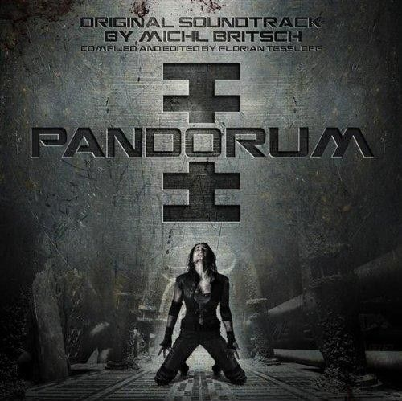
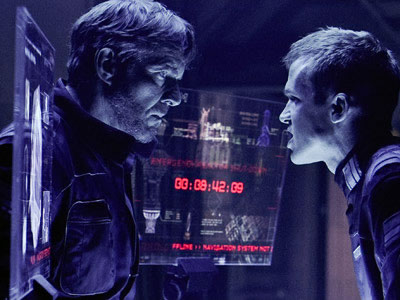
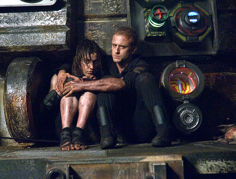
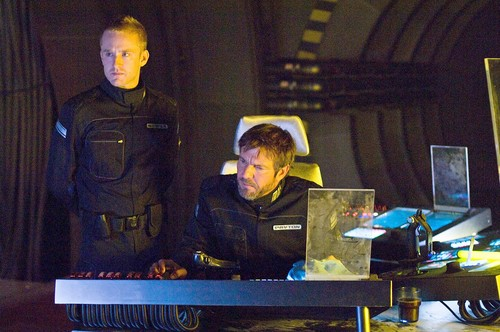

《深空失忆 Pandorum》

			【夫妻影评】《深空失忆 Pandorum》

老公的评论：
 

　　我不觉得这是一部好看的电影，但我相信有很多人喜欢这样的题材——在一个密闭的环境里，人和异形被困在了一处，然后就是杀戮和被杀戮，然后就是人类战胜了异形，或者是逃出生天……
 

　　电影里有一个部分我没看懂——女主人公认为那些异形都是由人类突变而成的，那么最后跑到那个类地行星上的地球人，会不会早晚都变成那样的异形呢？或者，那样的异形会不会被海水淹死呢，还是有一部分也坐着救生舱弹射了出来？也许这是续集的题材吧！
 

　　电影把地球灭亡，殖民外星，基因突变，心理变态等各种因素结合到了一起，我觉得电影不好看的因素可能就在于它太过于大了，如果着重表现一两个要点，可能情况会更好一些。
 
　　另外，这部电影给我留下深刻印象的是那个异形小孩杀死那个南亚人的场景，很另类，很黑暗。
 
　　我也幻想了那些活着的地球人在新星球上时如何生存的，总人口一千多，要多久才能繁衍壮大啊，很可怕！
 
　　这部电影也算是地球未来的一种想象吧，希望我们的未来要比电影中描述的美好的多。
 

老婆的评论：
 

　　在太空舱中被冻住了几十年的鲍尔醒来了，四周一片黑暗，没有任何其他人，很多事情他已经记不清楚了。正茫然时，船长佩顿也醒来了。2个被困住的人，想要逃离这个太空船，为此他们要奋斗一通。
 

　　鲍尔在去船的另一端修理飞船，发现飞船中有很多的突变生物，他随时都可能没命，在这一过程中，又出现了一男一女，他们属于已经与怪物奋战了一段时间了，为了能到达目的地，他们一起对付怪物。
 

　　其实整部影片的剧情很是简单，对于最近老看科幻影片的我，基本上没感觉到什么新意，而且一点都不够刺激，场面也不够大，一种小成本电影的感觉给我留下了深刻印象。
 
　　看一些介绍说，这部影片得过不少奖项，我真的觉得有的差异。是否因为电影的某种寓意我没有理解？
 
　　总的来说，还是属于一部很一般的电影。是不是因为我电影看多了，也变得挑剔起来了？

上映时间 2009

导演
Christian Alvart
编剧
Travis Milloy
 

 
主演
Bower……Ben Foster
Payton……Dennis Quaid
Gallo……Cam Gigandet
Nadia……Antje Traue							
		
http://blog.sina.com.cn/s/blog_52187ba90100guoh.html
