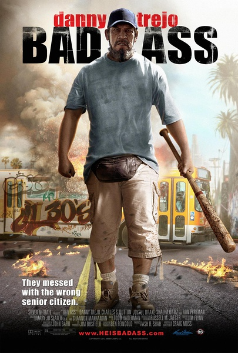
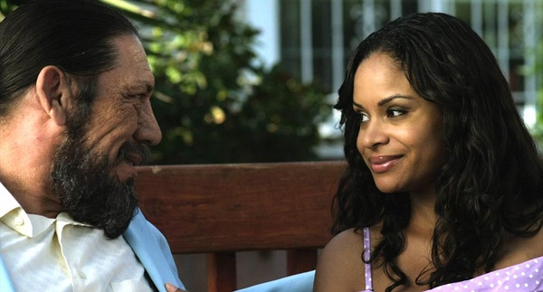

《混蛋 Bad Ass》

			

老公的评论：
 
　　第一点，必须要说的第一点，就是没想到Dan Trejo可以演一个好人，这点太“反传统”和“非主流”了。
 
　　查过资料才知道，原来Dan
Trejo真的是有犯罪历史的，也真的练过真功夫，看他演过那么多部电影，怎么说呢，算他浪子回头？还是说他找到了“真我”。
 

　　整体来说，《混蛋》有些幼稚，这让我想起了很久以前的一部电影《你好，出租车！》说实话，那部电影我已经有些印象不深刻了，但不知为什么觉得这两部电影有类似的地方，记得那部老片子的朋友一起来讨论一下吧。
 
　　1944年的生人，这部电影上映的时候Dan Trejo已经68岁了，真的感觉不出来，他的身手还是挺不错的。
 
　　故事只是简单的复仇，但是掺杂了一些网络元素，搞笑了很多，也显得人性化了许多。
 
　　在现实之中，这种人是不可能有的，但是我想这部片子的编剧、导演都希望真的有这样一个人能够出现吧！

老婆的评论：
 
　　这部电影剧情其实挺简单的，甚至有点幼稚，但给人的感觉很温馨。
 

　　很奇怪这样一部电影里，看到的好几个熟人，演主人公Vega的丹尼·特乔，演市长的朗·普尔曼，一直记得他演的《地狱男爵2:黄金军团》中磨犄角的片段，很是喜欢，还有那个警察的帕特里克·法比安，一直觉得在哪里见过，想了半天都没想起来，查了一下原来在《美眉校探》看过。
 

　　不喜欢Vega留的大胡子，本来他就丑，现在看上去又丑又脏，没明白为什么挑了丹尼·特乔当主演，至于Vega复仇的那段还是不错的，只是觉得那些敌人也特笨了吧。
 
　　额，特奇怪那个邻居少妇怎么看上Vega呢？哈哈！是因为Vega是英雄吗？
 
上映年份：2012							
		
http://blog.sina.com.cn/s/blog_52187ba901014uxl.html
