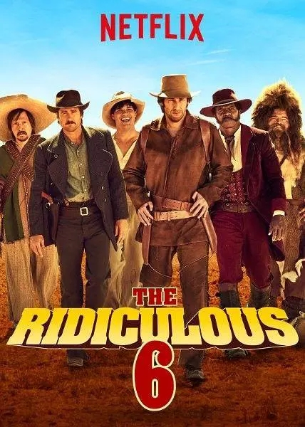
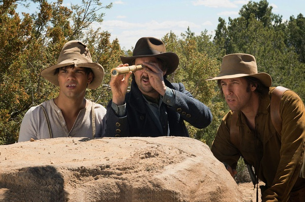
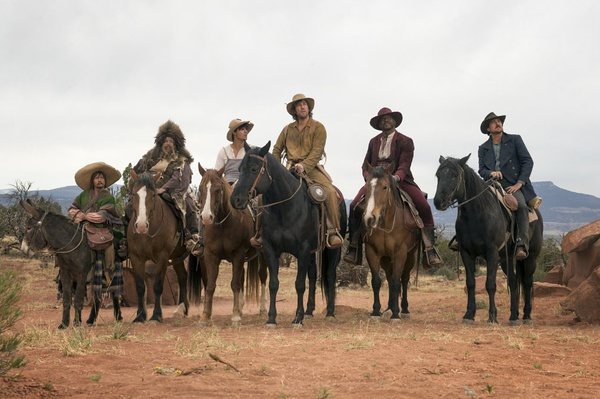

《滑稽六人组 The Ridiculous 6》

			

老公的评论：

　　我觉得这部电影不应该叫《滑稽六人组》，应该叫《荒诞六人组》才对。

　　实话实说，亚当·桑德勒还是一个我们看着比较顺眼的演员了，他出演的喜剧片虽然有些因为文化差异而不是很搞笑，但是也不应该烂的像这部电影一样。

　　从主题来说，我觉得这部电影唯一的概括语应当是“荒诞”，除了这两个字，我觉得别的什么都不用考虑，剧情荒诞、节奏荒诞、笑点荒诞、对白荒诞……

　　如果非要挑看点的话，我觉得电影中对于美国西部的塑造还是挺成功的，无论是氛围、色调还是场景、人物，都历史感十足。

　　这部电影，虽然让我看完了，但是真的说不出什么……，建议别看，哈哈。

老婆的评论：

　　我想这种认兄弟的方式够独特了，有那种制造奇迹的感觉，更可怕的是，这一场滑稽般的救父行动，都是那个所谓的生父想出来的阴谋。

　　本片刚开始的时候，我觉得挺不好看的，这些人物形象在那个特定的环境中，显得邋遢，个别镜头如挖眼珠看的让人恶心。

　　当然不能否定从Tommy（亚当·桑德勒饰）出发去找5万赎金，挨个的捡到自己的兄弟，他们不管是抢或者偷并筹够了足够的钱，这个事情很神奇。

　　我认出了钢琴手（泰瑞·克鲁斯饰）是演《神烦警探》的警察警长，要给自己加点分。哈哈！是因为老公没认出来。

　　总体来说，这部电影这部电影很荒唐，不是我喜欢的类型。

上映年份：2015							
		
http://blog.sina.com.cn/s/blog_52187ba90102x1l5.html
