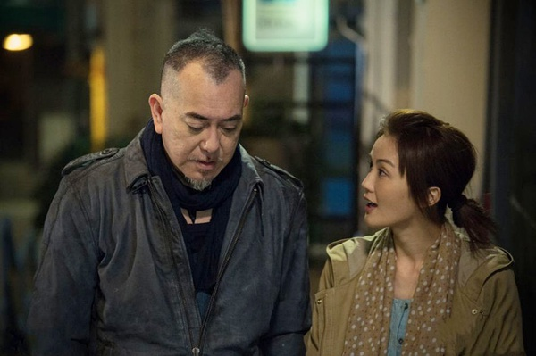

《潜龙风云》

			

老公的评论：

　　因为黄秋生的一些言论，最近开始不像以前那么喜欢他了，但是蔡卓妍的胖脸一直是我喜欢的，她不算漂亮，但是那种憨憨的感觉很有亲和力。

　　黄又南饰演的阿良其实还是挺酷挺帅挺有味道的，虽然阿良在剧中的结局比较悲惨，但是整部电影还是喜剧感觉更重一些。

　　这部电影的名字起得实在是太……了，《潜龙风云》——我一直以为又是无间道类的题材呢，没想到是个生活题材。

　　轻喜剧，冷幽默，还不错。

老婆的评论：

　　因为某些原因，我很不喜欢黄秋生，但也不否认，他演戏还行。

　　黄金贵是个很好的老大，他什么时候看出来其实阿良和阿媚互有好感的？我很遗憾，阿良死了，那么阿媚的爱情又会有新的变化，那其中会不会有黄金贵的机会？就阿良的死，也骗走了我一些眼泪，我想我的掉泪点实在是太低了，不够坚强。

　　像黄金贵那样的黑社会，其实已经不算黑社会了吧，不过，好像在讲义气方面还保留了黑社会的气息。阿Bill那么就是黑社会的正面人物了吧，卖毒品，用手段收地，杀人，所以最后被抓。

　　陈慧敏和吴志雄还在拍电影，年龄都不小了。

上映年份 2014							
		
http://blog.sina.com.cn/s/blog_52187ba90102vrh8.html
