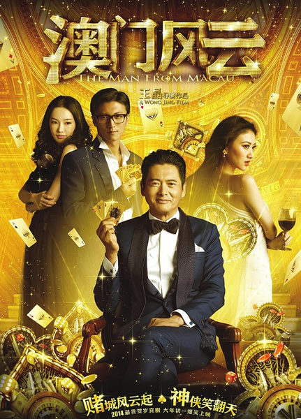
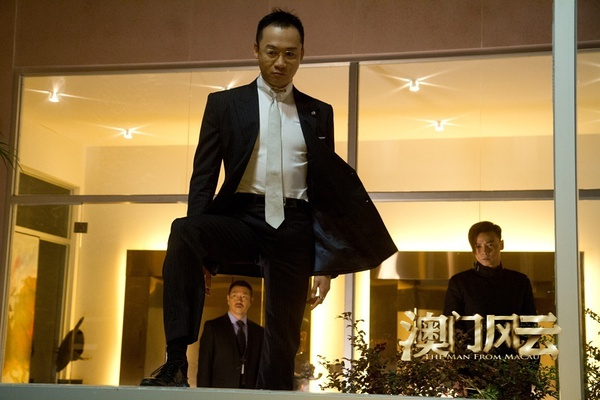
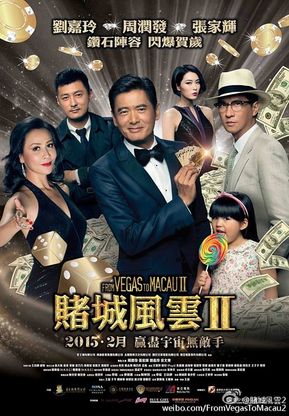

《澳门风云1 2》

			

老公的评论：

　　因为《澳门风云》中又杜汶泽，所以当时选择了放弃，而又因为《澳门风云2》中有石班瑜的配音，所以把第一部也找来了一起看一下。

　　拍这两部电影的时候，周润发已经快60岁了，但是化妆的效果还是真不错，看着要年轻了许多；谢霆锋年纪大了，好像没有小时候那种酷帅的风格了；余文乐的模样没什么变化，不过多了一份成熟感；张家辉虽然当了影帝，但是依旧觉得他演那种小混混要更像的多；刘嘉玲老了许多，又好像没怎么老，当年因为喜欢梁朝伟可是也很喜欢刘嘉玲的……

　　从我的角度看，《澳门风云2》最后刘德华以刀仔的形象出现真的很怀旧，让我一下子想起了很多很多看的当年的“赌片”，也想起了很多当时那个年代自己亲身经历的有趣的事情。不过，唉，俱往矣。

　　呵呵，没闹懂为什么两部《澳门风云》结尾的彩蛋都是赌神高进来和石一坚抢徒弟，不过没关系了，这种喜剧就是看热闹的，很多地方本来就不一定能够完全理解编剧和导演的意图，觉得搞笑就足够了。

　　电影里的特效运用的可真多，不过那些赌桌上纸牌满天飞的镜头好像并没有加深我对这部片子的投入度。

　　有时候看看老演员，看看复古的老桥段，觉得时间飞逝，又觉得自己还没有被时代淘汰……

老婆的评论：

　　这两部电影很不错，看着很热闹很让人高兴，关键是TVB的参与，很多熟悉的脸孔看着也，不要去管里面赌神为什么在后来会出现？也不要管为什么魔术手石一坚（周润发饰）如此之厉害？也不要管机器人为什么说四川话？

　　第一部，剧情很流畅，Benz哥（许绍雄饰）与他的儿子晒冷（谢霆锋饰）及外甥牛必胜（杜汶泽饰）来澳门参加石一坚的退休大会，大陆、香港以及澳门三地警察组织对付DOA组织集团的高先生（高虎饰），Benz哥的大儿子在DOA卧底被发现，资料被留在毛绒熊上，又被送坚哥爱女阿彩（童菲饰），最后逼着坚哥出手对付高先生。其间，谢霆锋和张晋的对打，坚哥神奇的扑克牌放倒一堆人，都很精彩。要是没有杜汶泽就好了。

　　第二部，这次是国际刑警来邀请坚哥出手帮忙了，还和DOA有关系，只是因为他的徒弟Vincent（余文乐饰）去了泰国寻找DOA的会计小马（张家辉饰）把一百五十亿美元找出来，坚哥为了徒弟只好出手。坚哥和小马在患难中建立的友谊和他那段忘不掉的初恋爱情故事，最后虽然破案了，可初恋情人却跳了飞机，也是一种遗憾。
　

第二部海报
 
上映年份 2014-2015							
		
http://blog.sina.com.cn/s/blog_52187ba90102vl1t.html
