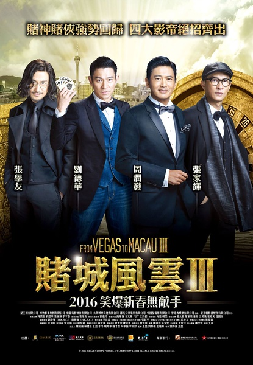
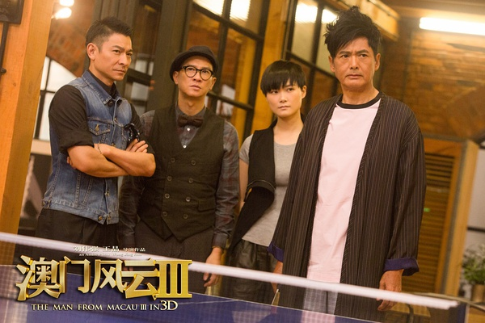
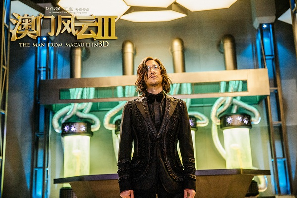

《澳门风云3》

			

老公的评论：

　　套用现在流行的一句话：看这样的电影，看的不是情节，是情怀。

　　我相信现在的年轻人是不知道《独自去偷欢》的，也不知道当年华仔劲歌热舞的场景，甚至，他们知道赌神从来不照相吗？知道三条三的典故吗？

　　我想，这部电影的口碑不高，真的不是情节、演技、特效的问题，问题是时间。四大天王里有两人出演，更何况还有发哥、张家辉、刘嘉玲……，这要是在当年，绝对不是一部简单的电影，而是会被大家翻来覆去看无数遍的电影……，但这一切明显都成为了历史……。

　　我想，如果大胆一点假设的话，《澳门风云》的下一部应该把周星驰请来，毕竟赌神、赌侠、赌圣凑在一起才是真正的“想当年”！

　　至于本片中酷炫的特效以及机器人打斗，我倒是觉得可有可无，我看的不是这些，是我自己的过去……

老婆的评论：

　　在看这部电影时，我一直在笑，并不是这部电影有多好看，而是，他们在一部电影中，有了其他那么多电影的桥段，这串在一起挺好笑的。要说这部电影有多好看，也没觉得。

　　我以为这部电影最大的看点在于热闹，这么多的老前辈们都出来了，周润发，刘德华，张学友，张家辉，向华强，余文乐……，再加上两个搞怪的机器人，真是热闹啊。

　　如果说石一坚（周润发饰）代表的正义一方，那么易天行（张学友饰）代表邪恶的那一方，注定就是要失败，最终还得赔上自己的小命。

　　当然赌圣出马，如何没有赌局呢？所以赌上几把是有必要的。

上映年份　2016							
		
http://blog.sina.com.cn/s/blog_52187ba90102wgz1.html
