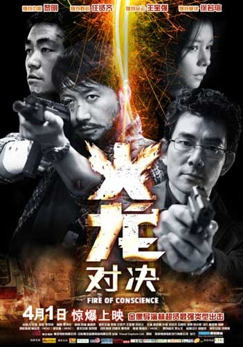
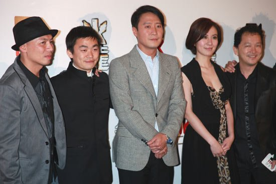
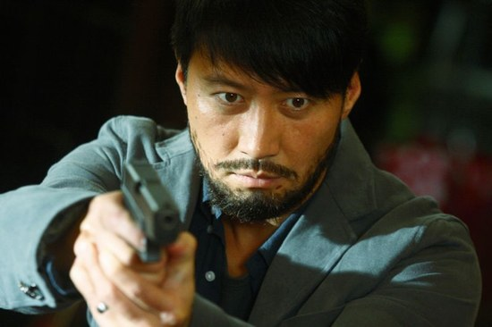

《火龙对决》

			【夫妻影评】《火龙对决》

老公的评论：
 
　　坦白讲，这是一部不错的港片，人物刻画的比较丰满，剧情也有起伏，主演的牌儿也够大，只是结尾略显平淡。
 

　　在一开始，我真的没想通这部电影的名字与剧情有什么联系，而当看到结尾的时候，才把属龙、舞龙、火龙联系起来，真的感觉有些牵强，不是很有必要做这样的铺垫。
 

　　剧情方面，总算是不拍卧底的故事了，不过依然是有警察为黑社会服务，只是这次这个警察要做老大，他试图用自己的方式来控制黑社会为自己服务。想想任贤齐扮演的这个角色，只是因为他喜欢的女人之前做过什么，就导致了自己的职位无法升迁，这一切确实有点不公平，但又确实很自然，很写实。
 

　　黎明最近也不知道怎么了，不再靠绯闻炒作的他似乎放弃了英俊的概念，专门走起了邋遢的路线，比起《十月围城》来，这次黎天王的扮相更邋遢，厉害。当年的四大天王里，好像就是他的外形变化最大，而且是向“不好”的方向去变化的。
 
　　王宝强依旧在糟践着我们国内一些贫苦地区人民的形象，依旧垃圾，早知道有他，这部电影可能我就不看了。
 
　　没有了周星驰、没有了《古惑仔》，不知道港片的真正复兴之日在什么时候啊？
 

老婆的评论：
 

　　看多了欧美的电视剧，回过头来看港台影片，有点淡而无味。这部影片给我的感觉就是这样的，看过唯一留下的那一点感触就是任贤齐和黎明老了。
 

　　从电影的风格调调一直是那种偏灰暗的，两大主演黎明演的探长文方给人的感觉，也有点灰暗，行事风格也不是让人很喜欢。而任贤齐演的纪sir，表面上看起来，好像挺光明的，故事没过多久就结了底了，他是一个伪君子，大坏蛋就是他。
 
　　从影片的情节来说，真没觉得有什么特别之处，这部影片总的来说，真可以不看。
 

上映年份
2010
 
导演
林超贤
 
主要演员
黎明
任贤齐
廖启智
叶璇
徐若瑄
　　							
		
http://blog.sina.com.cn/s/blog_52187ba90100jlt9.html
