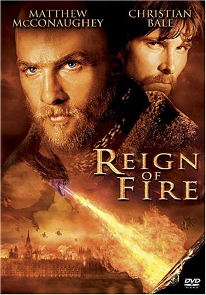

《火龙帝国 Reign of Fire》

			【夫妻影评】《火龙帝国 Reign of Fire》

 
老公的评论：
 

　　查过资料才发现这部电影居然是2002年的，坦白说，在观看这部电影的时候我一点没觉得，影片中的末日理念很有趣，居然说恐龙的灭绝是因为火龙的出现，不错，喜欢科幻的我可以把这个内容作为我未来创作的素材之一了。
 
　　在影片的开头，发现了巴特勒的名字，没想到他那么快就死了，想想啊，2002年，他还不够资格演主角吧。
 
　　这个电影的整体故事背景很简单，所以在看的时候并不需要动太多的脑子，不过在演出搏杀飞龙的时候挺好看的，比较激烈。
 

　　刚好这两天也看完了《异性庇护所》第二季，里面也提到了某些生物想要毁灭地球的言论，而其中人类的对答之一就是“人类已经变强大了，面对打击，他们会做出有力的回应”，我想《火龙帝国》中的龙族大概也没有想到人类的顽强吧。
 
　　除了蟑螂，地球上生命力最顽强的种族大概就是人类了。
 
老婆的评论：
 
　　喜欢这部电影，不知道是因为这部电影所塑造的人物形象让我喜欢，还是因为主人公奎因和凡·赞这种强悍的性格我喜欢。
 
　　整部影片的节奏还是挺紧凑的，情节也不错。
 

　　关于地球末日的故事，真的不少，这次用火龙来终结地球，好像还是有些不同的。在游戏中会喷火的，喷冰的龙也很是好用，但生活中要是面对这种变态的龙，可真是不幸，它们不仅要吃东西，并且大面积破坏人赖以生存的植物，太狠了！
 

　　面对这些繁衍能力超强的生物，如何才能战胜？人是不是要像奎因这样往地底下挖洞，越深越好？其实，这只是拖延了死亡的速度，火龙并没有放过这些。正在这个时候凡·赞出现了，他的出场就给人震撼，也给予人一种希望。在他、Alex与奎因的努力下，终是消灭了唯一的公龙。
 
　　电影给我的遗憾，是Creedy的去世。
 
 
上映年份2002
 
主要演员Quinn……Christian
Bale							
		
http://blog.sina.com.cn/s/blog_52187ba90100lmm3.html
