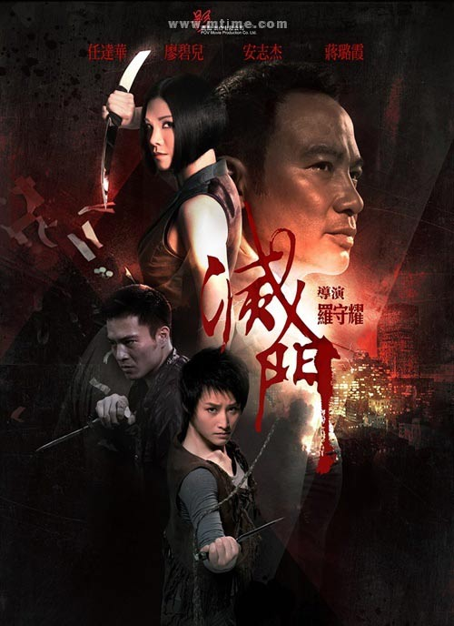

《灭门》

			【夫妻影评】《灭门》

老公的评论：
 
　　觉得这个电影很像之前吴京拍过的那种电影，一个人打好几百什么的，纯粹的动作片。
 
　　本因为任达华应该是一部好片子的保证，但没想到任达华居然在这部电影里演一个不怎么会打的角色，那么容易就被杀了，真可怜。
 
　　从一些动作细节来看，我觉得廖碧儿的有些动作还是显得有些“女气”，让她出演这么一个“武林高手”，挺另类的。
 
　　黎诺懿是近来我比较喜欢的演员，这次他扮演的角色居然被自己的亲姐姐杀死，也挺另类的。
 
　　又是一部复古风格的港片，杀人不用枪，用拳，最后却还是死在了手雷之下，早知道直接用枪多好……
 
　　是一部可以消磨时间的电影，但没有什么收藏价值。
 
　　张文慈自从在《我和僵尸有个约会》被我们认识之后，还有些好感，如今看来，变化并不大。

老婆的评论：
 
　　这部影片够没意思的。
 

　　黑社会的影片也看过不少，但黑社会老大骆家家族的毁灭却因为有一个野心勃勃的女人丽萍（廖碧儿），杀害无辜的弟弟（黎诺懿），利用沉默寡言的弟弟小牛（安志杰）后一样杀害。逼死哥哥祥福（任达华），爸爸的老婆们要杀，哥哥的老婆也要杀，总之很是残忍，可惜输给了忠心耿耿的哑女，被她抱着炸死，挺无趣的。
 
　　人还是做一个普通人的好，不要太贪婪最终的结果或许会好一点。
 

　　廖碧儿的电视剧看的不少，电影到不怎么看过，这次的形象可真不太好，脸显得很大，身材也壮的像男人，在演艺界她算是异类了，那些女明星们哪个不是瘦不拉几的。
 
上映年份 2010
 
主演
廖碧儿
任达华
安志杰
蒋露霞							
		
http://blog.sina.com.cn/s/blog_52187ba90100hy9e.html
