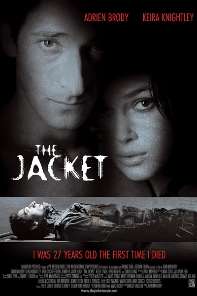

《灵幻夹克 The Jacket》

			

 
老公的评论：
 
　　虽然是05年的电影，但现在看来还有一定的可看之处。
 

　　和这部电影类似的影视作品包括《时间旅行者的妻子》、《时间旅者》、《在别处》，都是说主人公意外拥有了穿越时空的能力，并凭借自己这种能力达到某种目的。
 
　　不同之处，我想这部电影的主人公所穿越的，是“未来”。
 

　　现在的电影，有的场面弄的很大，背景弄得很深，但却因为场面太大而把控不住。而《灵幻夹克》是一个发生在很小的局部的故事，演员就那么几个，情节也没有什么复杂，因此显得很专注。
 

　　这部电影在开始的时候显得有些晦涩，不认真看的话可能还真有些弄不懂，但是随着剧情的推移，一个好像恐怖片的电影被拍得有了些许温情，值得好好欣赏。
 
　　让人有些不舒服的地方，是想象被关进停尸房的小格子之中，太残忍了，正常人被关上一段也会疯狂吧！

　　
老婆的评论：
 

　　看着看着就给我一种《时间旅行者的妻子》感觉。这部影片实在是需要很投入才能感觉到他的味道，不然的话，真不知道他在演什么？
 

　　结局部分，我到底也没有明白是男主人公杰克是穿越到了未来不用再回去了，还是把他从那个抽屉里拿出来，他还是要回到1992？而且这个穿越与他不死有什么关系？我也没弄明白。不过这些并不重要了，我还是很感动，杰克的穿越让贾姬的生活发生了变化，她的妈妈也没有死。希望他们的感情还能有所发展。
 

　　额，精神病院的医生很变态！还有男女主人公挺眼熟的，查了一下，的确是看过他们演的影片。杰克的扮演者阿德里恩·布劳迪演过很多影片其中《铁血战士》《金刚》我们都看过，贾姬的扮演者凯拉·奈特利原来演过《加勒比海盗》。

　　
上映年份
2005
 							
		
http://blog.sina.com.cn/s/blog_52187ba90100yzfr.html
