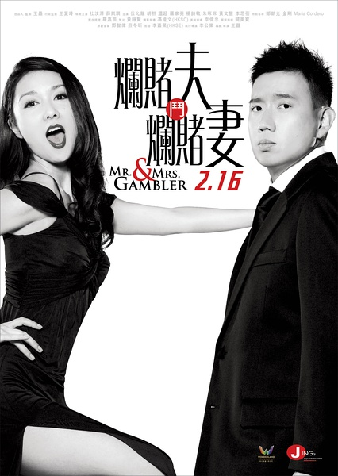
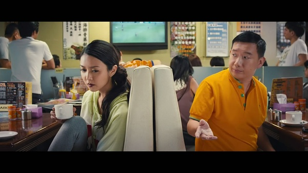

《烂赌夫斗烂赌妻》

			

老公的评论：
 

　　最近一直在主看电视剧，电影都少看了许多，更不要说港产电影了，虽然心里一直在祈祷，但是真的不知道什么时候港产电影才能再次辉煌起来。
 

　　杜汶泽是一位很有喜剧天赋的演员，近几年来他也比较红，大大小小的影片、角色，总有他的身影，但是以的演出，实在是追不上梁朝伟、周星驰和张家辉这三位同类型的前辈。
 

　　《烂赌夫斗烂赌妻》用了很夸张的手法去演绎爱情，特别是夫妻结婚多年的那种因为家带来的爱情，很夸张，因此也就是看个乐儿吧，谈不上有什么太深刻的感觉。
 

　　电影里有一句话让我记忆非常深刻，我记得大概是“张家辉平时生活力积压了很多的难过，可是他一直忍着不哭，到了拍戏的时候，就能哭得很逼真了……”
 
　　记得杜汶泽给我发差最大的一个形象是在《九龙冰室》里扮演的“九龙长毛”这个角色，唉，时过境迁……

老婆的评论：
 
　　高人指点千万别抛妻弃子额！哈哈，虽说觉得这个高人未必高，但道理还是对的吧！
 

　　老实说这部影片还是挺搞笑的，虽说我看了半天完了我也不知道自己看了些什么，可是在看的过程中，还是享受了一些快乐，所以至少过了及格线，要是真看不下去了就被砍掉了。
 

　　舒奇（杜汶泽饰）及香香（薛凯琪饰）都是赌徒，先是互相较劲，后来分别经过高人指点的两人结婚了并有一个女儿，舒奇的演绎事业发展的很顺利，有了婚外恋，而香香也与赌场老板的恋情也跃跃欲试，为了女儿的抚养权，这对赌徒要戒赌一段时间以得到抚养权，可到最后他们发现他们根本就不想分开。
 
　　爱赌成这样是一种什么样的感觉呢？
 
上映年份 2012							
		
http://blog.sina.com.cn/s/blog_52187ba9010183i8.html
