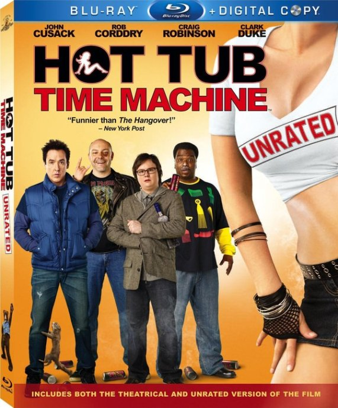
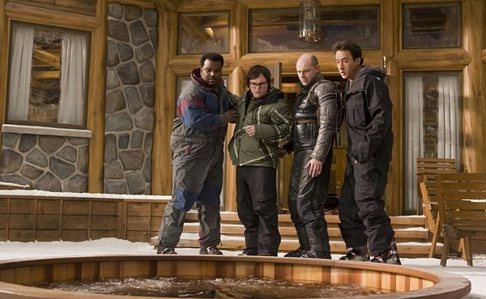

《热浴盆时光机 Hot Tub Time Machine》

			【夫妻影评】《热浴盆时光机 Hot Tub Time Machine》

 
老公的评论：
 
　　很难形容这部电影！
 
　　从剧情来看，很魔幻地演绎了穿越时空，又很科幻地描述了平行世界，很有趣！
　　从对白上来看，脏话连篇，我很不喜欢，难道美国人都是这样的人？
　　从效果上来看，很喜剧，很多场景真的会让人很高兴！
　　从结局上来看，很温馨，家庭与朋友，是人类多么与众不同的标志啊！
 
　　我喜欢科幻，喜欢这种穿越的幽默，喜欢人类的感情，一部电影，先要是一部好电影，再去评价他科幻不科幻吧！

　　一个浴盆，成了时间机器，科幻吗，不科幻吗？你觉得呢？
 

老婆的评论：
 
　　刚开始看的时候，还显电影节奏过慢，主人公们还喜欢说粗话，有点不喜欢，听老公说他也是耐着性子等着热浴缸时光机出现。
 

　　这部影片让我们刚开始以为与我们曾经看过一部电视剧《重回昨日》相似，主人公Erica回到过去作出不同的选择导致她的现在不同。这部有些不同，其中的卢就没有通过时光机回到现在，他是按照重来一次的过来的，人生不同，婚姻不同，也特别有钱了，喜剧的是一起旅行的雅各布还是他儿子。亚当的过去也改变了，他与冬令营的女记者在一起，这段时间对于他们来说只是一次旅行而已，而尼克与妻子也没有障碍了，他太搞笑了，在他未来的老婆9岁时，就打电话过去骂她，搞得那一家莫名其妙的。
 

　　电影中的美国80年代相当的混乱，里面还有一段，卢他们带着现在的装备回到过去的，小巧的手机，不一样的汽水让当时的人把他们当着是俄罗斯间谍，非要说这个汽水是炸弹汽水。还有雅各布非常担心改变了过去，自己出生不了，结果差点就被他自己搅局了。
 

　　这样电影与其把他当科幻剧来看，还不如当一部励志剧来看，人生有失意的时候，千万不要轻易妥协，了解自己懂得改变，世界就会不同的。
　　
上映年份
2010
 
导演斯蒂夫·平克
 
编剧
乔什·贺德
 
主演约翰·库萨克
切维·切斯
丽兹·卡潘							
		
http://blog.sina.com.cn/s/blog_52187ba90100nrfc.html
