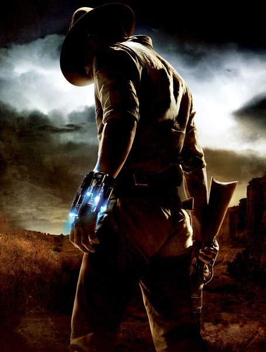
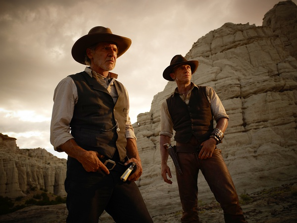

《牛仔与外星人 Cowboys & Aliens》

			

 
老公的评论
 
　　这是一部不用动脑子，只要跟着情节走就好了的电影，动作算不上火爆，特效也算不上炫目，但是可看。
 

　　克雷格和福特的演技都不用说了，我觉得另一个重点在于把美国西部片和外星人结合了起来。虽然外星人还是摆脱不了异形加铁血战士的老套路，但是，他们应该没有和拿着左轮手枪的牛仔打过吧！
 

　　对于很多文艺作品，如果不了解它的背景势必要对欣赏有一些影响，这部电影就是这样，美国牛仔、印第安人、淘金热，这些离我太远了，不知道美国人看西部片是不是就相当于我们看清装剧了，我觉得有可能。
 

　　看片子的开头，没想到是这样一个故事，我和老婆大人都觉得，如果那个外星女人在回来了就好了——我们总是喜欢喜剧和完美的结局。

 
老婆的评论：
 

　　这部电影给我的感觉很怪诞！西部牛仔对上外星人，我不得不承认这些人够敢想的。哦，这部电影还不错！其实开头我们就觉得既然是丹尼尔·克雷格选择的角色，应该差不到哪里去。
 
　　外星人要黄金也不知是干什么用？似乎没有太交代清楚，看来不管是人还是外星人都是爱财的主。
 
　　很意外Ella也是一个外星人，她能够复活那就没什么奇怪的啦。其实很期待结尾部分能给她和Jake在一起的镜头。
 

　　这么一个贫瘠的小镇，里面生活的人，似乎都挺开心的，恰如今天我和老公还在聊起的，其实小地方的人幸福指数要比大城市的人高，只是电视和网络带来了冲击，让这些本来开心的人变得也不再那么开心啦。还好本片中的牛仔们要幸福了，他们有很多的金子。
 
　　另外，我觉得本片中的小狗是我见过最不忠诚的小狗了。印第安人真是一个奇怪的种族！

 
上映年份
2011							
		
http://blog.sina.com.cn/s/blog_52187ba90100z57a.html
