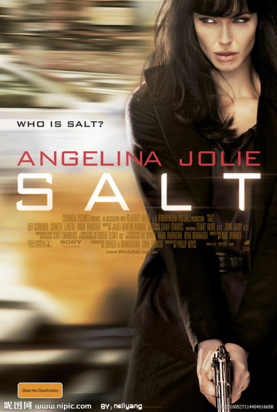

《特工绍特 Salt》

			【夫妻影评】《特工绍特 Salt》

老公的评论：
 
　　这是一部充满悬念的电影，在看之前，好友胖飞先推荐了一下，因为个人对朱莉没什么特别的看法，所以拖到现在才看。
 
　　电影才一开始，老婆大人就认出了那个被拷打的女人就是朱莉，很佩服，我基本叫不出西方女演员的名字……
 

　　在电影的最后，说那位新上任的美国总统访问了俄罗斯，并向1974年于俄罗斯罹难的家人献花，一下子让本以为平淡了的剧情又起了涟漪，如果绍特并不是像剧情所表现的那样，如果整个事件是一个巨大的局，目的就是让这个俄罗斯人成为美国总统呢？那么绍特所做的一切都是假的，那个放走了他的CIA成了整个故事里唯一被利用的非俄罗斯人。
 

　　这部电影的剧情一直在剧烈的起伏之中，作为观众的我，一直在猜主人公下一步要做什么？怪不得汤姆克鲁斯不接这部戏，就紧张程度和拍摄风格来说，真的和《碟中谍》有一些类似！
 
　　说打吧，不是非常打，说酷吧，也不是非常酷，就是这么一部电影，让我在看完之后还有怀疑：绍特对他丈夫的感情是真的吗？
 
　　我估计朱莉要是换个发型，她的下部电影我还是认不出她来！
 

老婆的评论：
 

　　邵特也在玩无间道，她是俄罗斯从小培养又放入美国的间谍，其实，这么小就被送去美国，什么都被改变了，其忠诚度是值得怀疑的。此片里讲了无数多俄罗斯的孩子，送去了美国，在未来为了国家都作出了相应的贡献，这是信仰所致吗？如果是这样的话，为什么还是挟持邵特的丈夫，最后还要杀死他呢？最后邵特为了给丈夫报仇，反过来一一杀死俄罗斯的间谍。本片其实并没有特多的内涵，要说是以动作是本影片的基调，那么相对于同期的《敢死队》，他又实在太逊了！
 

　　间谍多厉害的工作，实在是羡慕，感觉他们无所不能，邵特也是如此。在韩国被抓，怎么样都不承认自己是特工，在无数多中情局特工的包围下，改装个灭火器变成武器，一样可以走。这里值得说一下，她把内裤脱下罩在监控器上，其实没有必要有这么一出，刚刚还能用灭火器喷雾呢。徒手在高楼的窗户上爬来爬去任凭多少人找她，不是一样逃走，在各种汽车上跳跃，哇！女人能这样，实在太酷了。面对心爱的老公被水淹死，一样的要装的若无其事，再来一一剿灭这群人，要有多好的心理素质。

　　
　　看网络介绍说这部电影本来是汤姆克鲁斯演，但由于一些原因，改成朱莉了，朱莉很敬业，她光着脚跑那么远。
 
上映年份2010
 
导演
Phillip Noyce
菲利普·诺伊斯
编剧
Kurt Wimmer
科特·维莫
Brian Helgeland
布莱恩·海尔格兰德

主演
Salt……Angelina Jolie
绍特……安吉丽娜·朱莉							
		
http://blog.sina.com.cn/s/blog_52187ba90100nq94.html
