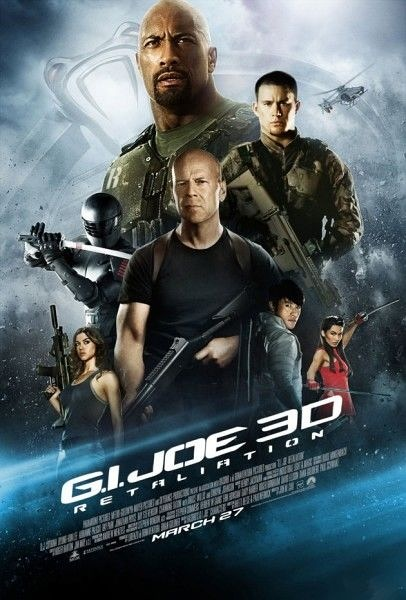
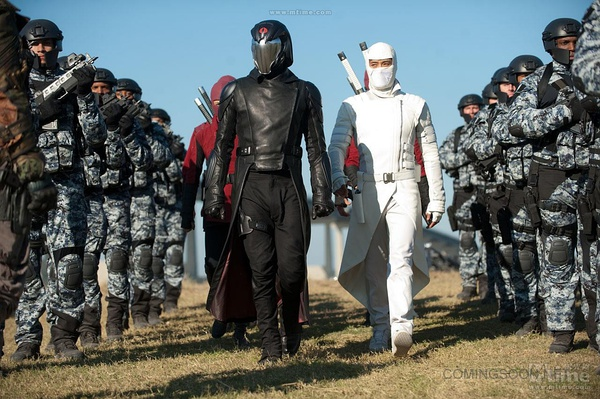
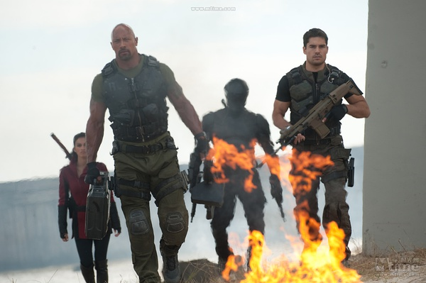

《特种部队：全面反击》

			

老公的评论：
 

　　在经历了《付出与收获》被我们弃看之后，强森凭借着《速度与激情6》以及这部《特种部队：全面反击》又重新让我们增加了对他的信任。
 

　　因为时间有点久了，我几乎已经忘了上一部讲的是什么，不过对白幽灵的印象还是很深刻的，说心里话，我并没有看懂在本作当中他为什么背叛了眼镜蛇指挥官，按照剧情的交代，他是一直知道杀师父的人是撒旦的，怎么一下子就站到了特种部队的一边？
 

　　剧中的萤火虫和纳米变脸都是我不怎么喜欢的“科幻”，因为这两样技术可以让剧情增加许多无聊的“元素”，比如反派可以用纳米变脸变成任何一个人，这样的仗还怎么打？萤火虫也一样，有这么厉害的炸弹，为什么还要一拳一脚地去硬拼呢！
 

　　剧中有一些特效还是非常酷的，比如蛇眼用枪打白幽灵的飞镖，还有蛇眼他们在峭壁上飞翔，很酷，场面很震撼，让人有向往的感觉。
 

　　看着科技的发展，我真的有些担心总有一天电影都不用人拍了，演员只是坐在摄影棚里出演一些室内的剧情，其他一切都靠特效来完成，那样的电影或许并不难看，但是也就没什么意思了。

 
老婆的评论：
 
　　这种电影就属于爆米花电影，看的时候真过瘾，但实际上想想又觉得什么也没演似地。
 

　　从影视作品里看，在美国当特工啊，当特种部队啊都是很不好的职业，因为你极有可能成了政治家的牺牲品被自己国家的另一伙人灭了，这次就是这样，最后只剩下3名队友，当然留下的自然是厉害中的厉害了，仇是一定会被报的。
 

　　这部电影从两条线展开的，一边是拦路虎带领特种部队剩下的人追查总统真相，一边是蛇眼和红花女抓白幽灵，这些打斗很精彩。最终这两条线合在一起，与眼镜蛇来个正面的对决。可惜最后眼镜蛇又跑了，估计是为了下一部电影留下伏笔吧。
 
　　最近好多部电影都有布鲁斯威利斯的身影！
 
　　这部电影里有我鄙视的变成一样的脸的桥段，我觉得这种编法太没有内涵了，动不动就变一样，一点都不好玩。

上映年份　2013							
		
http://blog.sina.com.cn/s/blog_52187ba90101e0kb.html
