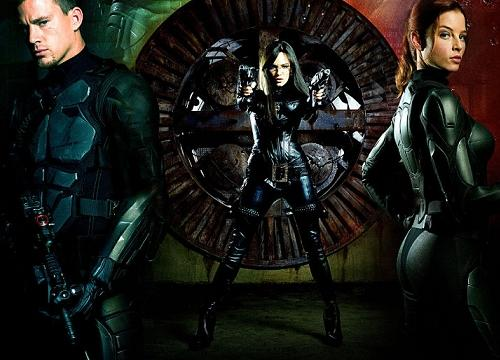
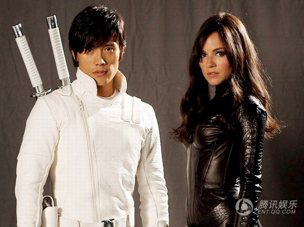
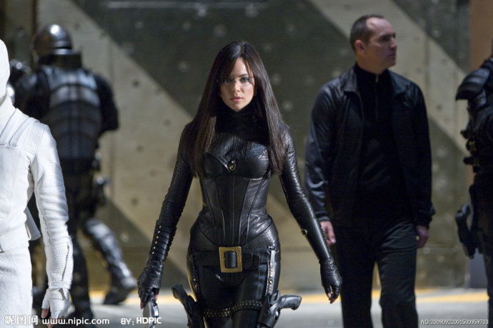

《特种部队：眼镜蛇的崛起》

			【夫妻影评】《特种部队：眼镜蛇的崛起 G.I. Joe: Rise of Cobra》

老公的评论：
 
　　这正是我想看的电影，我个人觉得它是一部并不逊于《阿凡达》的好片子。
 
　　超级科技，可能是对地球男性具有普遍吸引力的题材，而将这种题材用于军事战争里面，就更有意思了。
 

　　影片中给我印象最深的，是公爵它们穿的那种特殊的衣服，太深了！这种感觉，就像……，你明明知道这不是真实的，是属于幻想的范畴，但你又从心里深深地希望这是真实的，希望这些事情就发生在你身边，希望这个世界真的还有我们不了解的一面，就像那个沙漠下面的基地，或者是那个北极海底的城市。
 

　　二战之后，关于世界的秘密军事科技，有过很多的传说了，但这个，我觉得最精彩，也让人最向往，只不过，不喜欢里面的日本人显得很猖狂的样子。
 

　　高兴的事情是又一次看到了Doctor，欧美的电影、电视剧看的多了，发现慢慢的也熟悉了，就像我们看港片一样，不错！结尾的悬念也留的不错，美国总统被画皮，有意思！
 

　　纳米虫，多好的宝贝，要是我奶奶的癌症能用它们来治疗就好了。老爸的心脏不用支架，自己就可以调节，很高兴，累了两天没有白累！今天小吴介绍的客户也谈的不错，希望每件事情都有好的结果，希望我们这个团队能够度过眼前的难关，一起发财！
 

老婆的评论：
 

　　大片就是有大片的风采，精彩的故事情节，丰富的人物想象及带来非常棒的视觉享受，当然也让我见识了高科技的魅力。这部影片给了我们意想不到的效果，值得一看。
 

　　从故事情节来看，“特种部队”阵营代表了绝对的正义，以霍克为首带领公爵等人正在捍卫全世界的和平，而“眼镜蛇”阵营代表了绝对的黑暗，在以戴斯卓大反派麦卡伦·迪斯特罗为首带领男爵夫人及医官等人正在算计着其他的国家。黑暗势力导演了一场追逐纳米武器的游戏，把特种部队耍了，当纳米虫开始吞噬法国时，这些正义的人发出了反击，结局当然是特种部队赢了。故事还是给大家一个出人意料，那个神秘的医官，却是男爵夫人的弟弟，是当年公爵要保护的女友的弟弟。
 

　　这部影片我最觉得爽的是影片的视觉效果，简直太棒了。这些飞机造型都太酷了，在深海里的建起的地下城，在沙漠中建起的地下基地，让人看的感觉太不可思议了。
 

　　其实关于白幽灵与黑面人之间的那段，我到是觉得在此片中可有可无，他们俩的恩怨在本片中其实显得并不那么的重要，当然加上他们俩的这些打斗，电影的元素加多了一些也会显得更精彩了。
 

 
上映年份 2009
部分演员职员表
导演
Stephen Sommers
编剧
Stuart Beattie
David Elliot
 
 
主演
Duke……Channing Tatum
公爵……查宁·塔图姆
Ripcord……Marlon Wayans
开伞索……马龙·韦恩斯							
		
http://blog.sina.com.cn/s/blog_52187ba90100gup0.html
