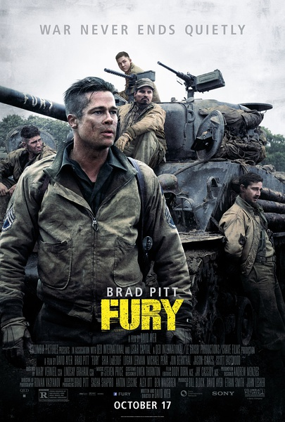
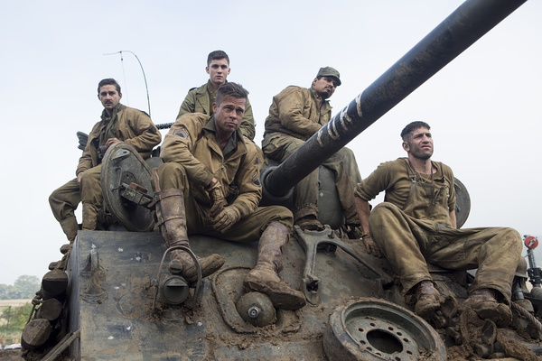
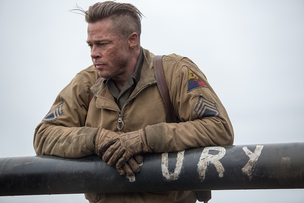

《狂怒 Fury》

			

老公的评论：

　　还好电影并没有设计成主人公们获得了小战役的胜利，要不和中国的抗战神剧也没什么区别了。

　　皮特还是老了，不过气质还是棒。

　　在观看之前，我一直以为这部电影是很打的，看过之后发现虽然是二战题材，但是战斗并不是主线。

　　我和老婆大人讨论最多的，是诺曼会不会有“幸存者内疚”的心理障碍，我想他会有。不过电影的整体剧情安排的还是合理的，毕竟诺曼是个新兵，之前也没有杀过人……

　　虎式坦克真的比谢尔曼要厉害多，对于不熟悉的朋友也算是一次科普吧。

　　老婆大人一直觉得在同伴的坦克被摧毁的时候，既然知道自己要去做一次艰难的阻击，那么主人公们应当多搬一些弹药到自己的坦克上来；而我则认为既然要打这场仗，会不会从之前的山地就开始开火更好一点，至少可以为后面修坦克的战友争取点时间……

　　看二战，看皮特，都是一种情怀吧……

老婆的评论：

　　战争从来都是可怕的，会有很多的牺牲，生命在这个时候显得太渺小。

　　在二战扫尾时，绰号“战争老爹”的坦克小队队长唐·柯利尔（布拉德·皮特饰）刚刚与战友经历了一场殊死之战，受到敌方的顽强抵抗。

　　坦克小组有人牺牲有人加入，这次加入“狂怒”的打字员诺曼（罗根·勒曼
饰），他对战场很陌生，很害怕很慌。就这样也不能停止提枪杀人。

　　他们小队和其他三个小队受命去阻击德军，三个小队陆续牺牲，只剩下他们小队，而他们的坦克狂怒出问题了，此时，德军有一只部队要从此处过，队长唐要留在坦克处不走，其他人都自愿留下。

　　这次以少对多的战役打响了，最终只活下了诺曼。看的时候心情很澎湃……

上映年份 2014							
		
http://blog.sina.com.cn/s/blog_52187ba90102wsyl.html
