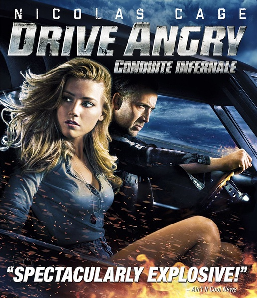
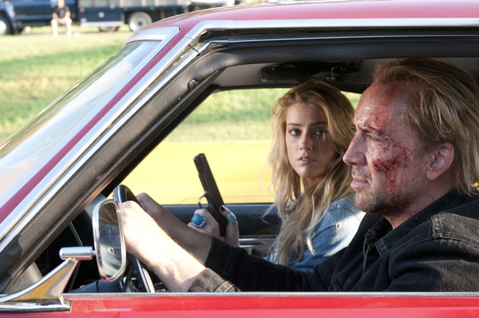

《狂暴飞车 Drive Angry》

			

 
老公的评论：
 
　　说实话，有点难以形容这部电影带来的感觉。
 

　　按说，有凯奇，有不死之身，有从地狱归来，有对坏人毫不留情的杀戮，这本应当是我们最喜爱的题材了，但这部电影的拍摄风格让我总是觉得有一点遗憾，有一种还没看到最精彩部分的感觉。
 

　　电影的导演不愧是恐怖片的爱好者，这部电影中够血腥，特别是在米尔顿被“杀死”之后对脸部的特写，其实挺恐怖的，当然还有那个被“会计师”钉在墙上的那个人，对了，还有很多裸体女人，有点过了……
 

　　可能我觉得这部电影有意犹未尽的感觉，是因为凯奇在这部电影之中并没有发挥吧，他所扮演的角色就是一个暴力的角色，我觉得这不是属于凯奇的戏路。
 
　　片子的悬念设计的不错，在一开始，我并没有想到主人公逃出的监狱居然是地狱。
 
　　这部电影最可看的角色我认为是“会计师”，特别是他开着卡车给米尔顿解围的那一幕，很是有趣！
 
　　不知怎么，觉得现在好看的电影越来越少了，是胃口被吊高了？还是我选的电影碰巧都不是最好看的？

 
老婆的评论：
 
　　现实世界又带出超现实的故事情节，除了不喜欢太血腥和女演员露的太多外，这部影片的整体感觉挺不错的。
 

　　之前看过《邪恶力量》里的主人公从地狱中走出来过，不知道弥尔顿是如何走出地狱的？影片没有交代，但弥尔顿为什么要从地狱里走出来呢？因为他的外甥女，他要去救他的外甥女。一方面他要应付地狱来追杀他的“会计师”，另一方面他要为女儿报仇杀了邪教头子乔安王并解救他的外甥女。
 

　　那么酷的电影怎能缺少一个漂亮的女主角呢，派伯的出场，派伯与弥尔顿一起去复仇，其实我没想到这个女人如此的厉害，在邪教头子的车里一人挑战多人。
 
　　哦，会计师的出场总是很张扬，那开车慢悠悠的来对付一群警察的场景，我和老公一致觉得很酷。
 
上映年份
2011							
		
http://blog.sina.com.cn/s/blog_52187ba90100yyir.html
