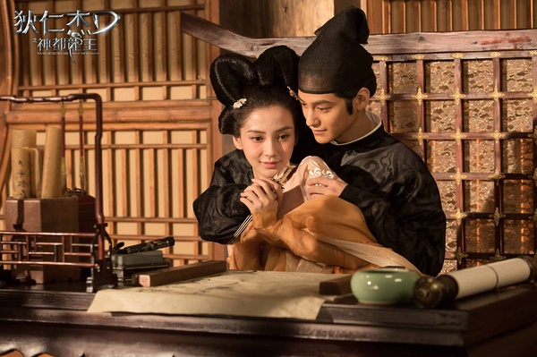

《狄仁杰之神都龙王》

			

 
老公的评论：
 
　　好友华少把这部戏评价的很低，我看过之后，却不怎么同意他的想法。
 
　　从特效上来看，这部电影是挺差的，但这方面刚好不怎么影响我，我看的更多的是剧情。
 

　　从剧情角度来说，虽然这个狄仁杰的外貌猥琐了一些，但是整个故事还是连贯的，虽然有些“古代科幻”的感觉，但是整体并不是完全没有合理性可言。
 

　　就今天人们的认知而言，狄仁杰留下来的故事可以用传奇来形容，再加上当时武周前后的背景，其实是有题材可以挖掘的，就看怎么利用了。
 

　　如果是我的话，我觉得元稹的故事已经完全可以是一部完整的电影了，在电影中设置两条主线，显得有些多了。东岛人的故事显得多少有些夸张，不过，确实也“很徐克”。
 

　　再多说一句，如果是我的话，应该会在感情戏上加一些题材，至少要把元稹的“曾经沧海难为水，除却巫山不是云。取次花丛懒回顾，半缘修道半缘君。”给引出来。“不负如来不负卿”曾经火了那么久，“半缘修道半缘君”应该也不会差多少吧！

 
老婆的评论：
 

　　勉勉强强的也就把这部电影给看完了，当然相对看不下的电影来说，他又比较好看，至少我觉得比《一代宗师》要好看的不是一点半点，因为《一代宗师》连一半都没看完，我就实在看不下去，对不起啊，梁朝伟。
 

　　看着像有科幻色彩的电影，却是用中国民间的传说的方式来演绎，人变成怪物是因为蛊的原因，怪龙也是因为蛊吗？其实到也无所谓，只是觉得真要能养成这样的怪物挺好的。
 

　　这部影片塑造的狄仁杰（赵又廷饰）非常的聪明，功夫也不错，与尉迟真金（冯绍峰饰）合作一起解决案子，算是不错的搭档，两个这么厉害的人，最后还免不了被武则天（刘嘉玲饰）整了一下，这种小细节处理的不错。
 
　　看见陈坤有客串，看完电影我和老公都不知道陈坤客串了谁？最后是看字幕才知道的，化妆的力量啊。

上映年份　2013							
		
http://blog.sina.com.cn/s/blog_52187ba90101e0km.html
