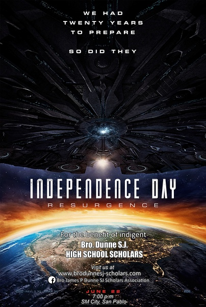

《独立日：卷土重来 Independence Day：Resurgence》

			

老公的评论：

　　电影的开头稍微有一些沉闷，从外星飞船来了之后就有看点了。

　　在我看来，电影想用这么小的篇幅表述清楚两个男主人公从敌视到兄弟的转变是比较难的，而且，观众们想看的也不是这个——和外星人大战嘛，打就是了。

　　电影的外星人让我很容易地联想到了《异形》，前几天还和朋友聊到这部经典，我觉得《独立日：卷土重来》中的外星人真的很像异形的套路。

　　很多时候，关于外星人的电影都会走同一种模式：他们的科技很先进，但是他们的社会形态很落后，说落后可能不对，准确的表述应该是很像地球上的动物，特别是昆虫。我不知道原创作者们这么设计的逻辑体系是什么，但是这么设计确实是让外星人有了弱点。

　　看这部电影，又升起了现在的电影“重特效而不重剧情”的概念，希望以后的电影要有特效，更要有剧情才最好！

老婆的评论：

　　在没有看独立日第一部的情况下，看的独立日第二部，所以，影评中塑造的一些形象，没有那么的清晰。

　　整部电影给我的感觉是出现的人物实在是太多了，第二个感觉中国企业走进了美国大片中，中文不知不觉中，也出现在美国大片中，这应该是一种进步吧？！

　　就剧情而言，外星人想要入侵地球，占有地球上的资源，而以美国为代表的地球派，克服种种困难赢得了最后的胜利。

　　看完电影后，老公提到为什么外星科技可以如此发达，而外星人的形态却如此的原始，我也觉得，编剧有意丑化了外星人的形象，在我的想象中，即便外星人和地球人形象不一致，那也是应该更加时代感，更加高科技才对，至少应该进化成《神秘博士》中赛博曼这样。

　　就电影的场面来说，挺符合科幻电影的特点，先是在月球上发生的事件，再是外星人进攻，城市瞬间就连根拔起，掉落后能毁掉一切的壮观，场面很震撼。

　　另外，我觉得本片出现的小朋友这些剧情挺多余的。　

上映年份：2016							
		
http://blog.sina.com.cn/s/blog_52187ba90102x18v.html
