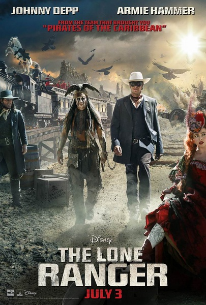
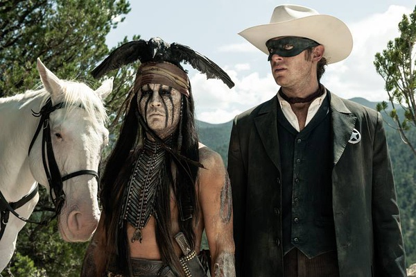
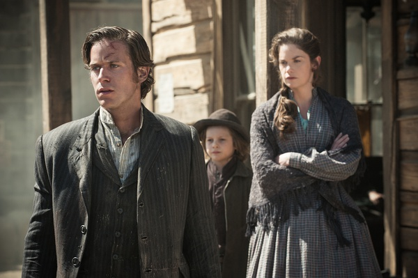

《独行侠 The Lone Ranger》

			

老公的评论：
 

　　看开头的时候，觉得这部电影好像看过，最终还是让我想起了小学时候很是崇拜过一阵的《游侠传奇》，不过我能记起的只剩下了三个元素：那匹叫“银子”的马，银弹，和卡文迪许这个名字，这种穿越的熟悉感，这种deja
vu的感觉，让我很是和老婆大人显摆了一番。
 
　　这部电影之中有许多我们喜欢的元素，比如打斗，比如不苛求遵循法律的执法官，还有必须具备的条件——幽默。
 

　　实话实说，《加勒比海盗》并没有让我觉得约翰尼·德普的作品是一个必选的选项，但是这次他扮演的唐诺真的很有趣，给我留下了很深的印象，说起来，这可能是给我留下印象最深刻的一个印第安人形象了。
 

　　说漏了一点，对于《游侠传奇》，我还记得主人公练习射击和骑术的一些场景，不过这部电影显然省略了这些对于主题并不重要的内容，而把笔墨都花费在了主线上，感觉编剧和导演都很有功力。
 
　　看了一大半吧，我们两个忽然发现扮演卡文迪许的居然是《越狱》里面的马洪，又看到熟人了，而且反差很大，有意思，有意思！
 

老婆的评论：
 
　　这是一部好看的电影。要比《美国队长》好看很多。
 

　　看完这部电影，在保护地域和遵守法律来说，我觉得这里以联邦检查官约翰·雷德为代表的正派没有错，结果在当时西部这特殊的环境下，但很难实现，想要保护这里和为哥哥等骑警报仇用法律是行不通的，约翰·雷德只好选择当独行侠与印第安人Tonto一起完成这特殊的使命。
 

　　反派是以杀人魔头卡文迪什为首同他的兄弟铁路局长一起，想把属于印第安人的白银给抢走，到处杀人抢劫，以挑起事端，好军事镇压印第安人，这样的人是要被唾弃的。但某种意思上，西方就是这样强大的。
 

　　电影中有几个镜头显得那个印第安人Tonto很淡定，比如在火车的梯子上等着转到另一个火车上、在火车快要掉下桥他还很轻松的呆着。与马聊天，尝尝沙土显得他很神秘。
 

　　老公不说印第安人Tonto是约翰尼·德普主演的，我还没看出来，倒是卡文迪什是《越狱》中的马宏看出来了，哈哈，又找到熟人了。
 
　　美国西部文化，是很有意思的一种文化。

上映年份　2013							
		
http://blog.sina.com.cn/s/blog_52187ba90101fvai.html
