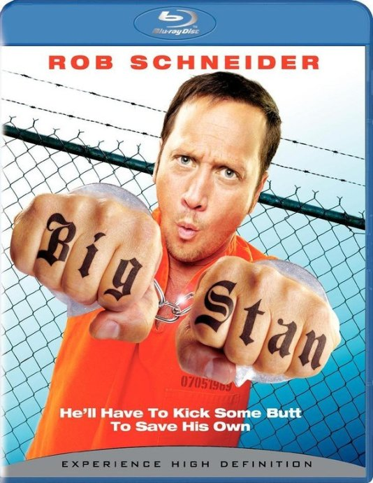

《狱中豪杰 Big Stan》

			 

老公的评论：
 
　　之前真的不知道罗伯·施奈德是何方神圣，印象中也没有看过他的作品，但是这次看来，真的不错。
 

　　《狱中豪杰》中有一些故作粗俗的地方，但是就整部电影的调子而言，还是很明快的，有点突兀的地方就是主人公的性格怎么就从一个骗子变成了一个正直的侠客，这个弯虽然转的不好，但是并不影响整部电影的好笑。
 

　　不知道这部电影的成本如何，但是从观众的角度而言，导演加主演的罗伯·施奈德一定是个中国老功夫电影的影迷，在这部电影之中，虽然有一些西方文化的东西，但是大多数时候，很成龙。
 

　　是喜剧，其实这部电影在我看来并不能算是真正的动作喜剧，其中武打的部分还是以“花拳绣腿”为主的，不过这些都是为了衬托电影的主线，无伤大雅。
 
　　监狱里的那个Big Stan那个室友白发老头怎么看怎么像是一个精灵族的人，演神话故事应该都不用化妆吧。

 
老婆的评论：
 
　　这个故事有点成龙的味道。
 
　　整个影片节奏比较明快，故事情节也有点意思，谁能想象把监狱的各种恶霸变成友善的人？Big
Stan做到了，还组织大家跳舞，读书太逗了。Big
Stan是一个骗子，在外面连老太太都骗的主，不知道是不是那6个月的锻炼使他性格大变，到了监狱竟然变成另一模样，看来吃活蝎子活蛇能改变人哦。
 
　　额，我觉得Big Stan的妻子值得一说，这个简直就是《完美妻子》中造出来的机器人妻子。
 

　　这部影片整体上挺简单的，就现在我写影评时，我都感觉没有什么特多想说的，只是看的时候觉得能看，有些意思，尤其是在要打架监狱长要得逞时，囚犯们跳起舞来，这个时候监狱长就成了绝对的坏人了，角色一下就被转变了，居然为这些什么坏事都干过的坏人而松口气，电影有他成功的地方。
 
上映年份:2008
主演
罗伯·施奈德 Rob Schneider							
		
http://blog.sina.com.cn/s/blog_52187ba901012ppe.html
