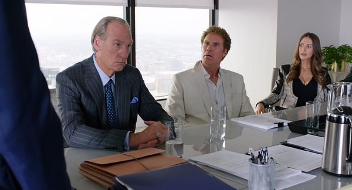

《狱前教育 Get Hard》

			

老公的评论：

　　一部纯粹的喜剧片，脏话有点多，消磨时间很不错。

　　一般来说，对白中满是脏话的的电影是不会被我们俩喜欢的，不过这部电影中的脏话大多是主人公们在学如何应对“监狱生活”的教材，所以显得还不是那么“不健康”。

　　在我看来，这是一部很老派的电影，我觉得这个剧本写于15年前都有可能，因为电影里并没有什么一定要现在科技完成的东西，也正是因为“老电影”，才会从剧情上去做文章，去寻找笑料。

　　从整体性上来看，这部电影还算是一个有内涵的故事，但是从细节上来看，这部电影的笑点都挺“傻”的。

　　不过傻笑也是笑的一种，在一种轻松的氛围里度过一个半小时，还不错啦。

老婆的评论：

　　本片的主人公詹姆斯（威尔·法瑞尔饰）很可爱，很能干，学什么像什么，当然，那傻乎乎的劲，要不陷害他，那真是可惜了，这个角色具备monk的特点，真是让人又爱又恨。

　　被判要入狱十年，为了能更好的适应狱中生活，他请了号称自己有狱中经验的洗车小弟巧克力教他狱中经验，在这一过程中，他真是太搞笑了，不得不说他的学习能力超强，学什么像什么，最后巧克力都“怕”他了。连黑帮他都要加入，还好被巧克力阻止了。

　　在巧克力家呆了一晚，巧克力老婆说他应该是被冤枉的，让巧克力真正的帮助他，巧克力女儿认同说就他这样学校都混不下去。这个我也早早的就猜到了他是被陷害的。

　　还好最后他洗掉冤屈，一高兴把枪拿出来，结果还是被判了6个月。

　　去除一些我不喜欢的语言，我觉得这部电影还是很喜剧，很搞笑的。

上映年份 2015							
		
http://blog.sina.com.cn/s/blog_52187ba90102vrh9.html
