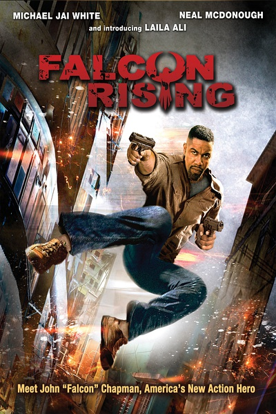
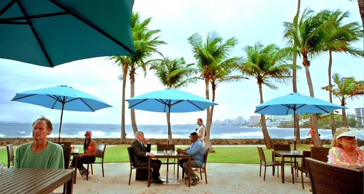

《猎鹰突起 Falcon Rising》

			

老公的评论：

　　看多了美剧，总觉得这种小成本的电影对于故事的前因后果交代的不是很清楚，虽然一些对于过去的闪回可以让我明白主人公性格的成因，但是对于主线剧情还是有些意犹未尽的感觉。

　　同样是孤胆英雄风格的电影，但是比起前不久我们看过的丹泽尔·华盛顿主演的《伸冤人》，《猎鹰突起》明显差了许多，大概这就是演员与明星的差别吧。

　　这种纯粹的动作片在剧情方面我很难评价什么，反正就是有仇了，报仇，报仇了……就完了，这部电影中还加了一些正义感，让主人公的私人恩怨上升到了打击罪犯的高度。影视作品的剧情就是这样：如果想让好人胜利，坏人就要笨一点，这部电影里的罪犯们就有点笨……

　　从结尾来看，这部电影留下了伏笔，也许会有续集，算不上多好看，但是可以消磨时光，不至于看到一半看不下去。

老婆的评论：

　　被罪恶感和创伤后应激障碍（PTSD）折磨的军人查普曼，除了喝酒，他好像不能做别的什么了。

　　妹妹被慈善机构派往巴西平民窟做事，结果受了重伤，接到他的好友巴西大使馆副领事的电话，他火速前往，并孤身去平民窟调查整个事件，因为身手太好，倒也不怕的。

　　孤胆英雄的戏，还真是百看不厌，但整体上这部戏，显得单薄一些，又是警察被收买了，黑社会太坏，操纵了这个平民窟，偷走小女孩卖，真是太坏，当然了正义必然会战胜邪恶，只是时间早晚的问题，最终查普曼打垮了黑社会集团还救出了这些小女孩。

　　我还想他的好友副领事也是被收买了的坏人呢，结果还好，并不是所有人都有当坏人的潜质。

上映年份 2014							
		
http://blog.sina.com.cn/s/blog_52187ba90102vp4e.html
