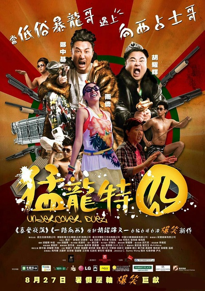
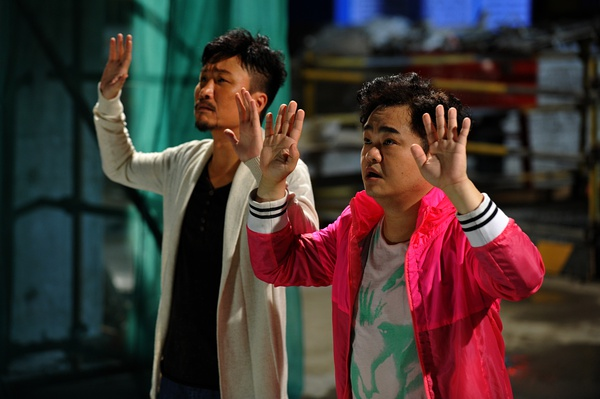
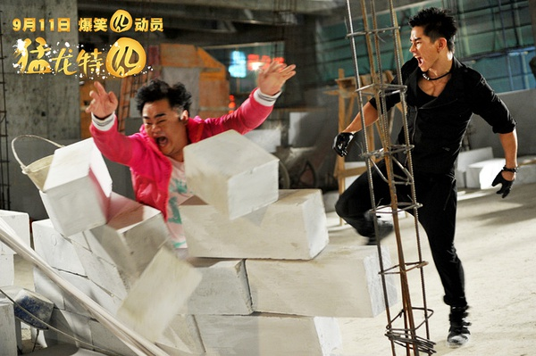

《猛龙特囧》

			

老公的评论：

　　要不是对郑中基的喜剧还有一丝丝地期待，我想我是不会坚持把这部电影看完的，结果，很失望，看来郑中基也不是我的港产喜剧的保证了……

　　套用现在比较俗气的一句话：这部电影的颜值太低了，低的已经足以拉低故事情节的喜剧效果，纵然是港片，纵然这是一个影视作品卖丑的年代，也不用这样吧？

　　胡耀辉也许是个有特点的导演吧，我没看过《3D肉蒲团》，不知道他的水平到底如何，但他在《猛龙特囧》中扮相和演技，我其实很难恭维。

　　就喜剧而言，剧本没有太大的问题，除了刘梦龙为什么可以聚齐出拳没有交代清楚外，其实保持了港片的常规水准，但是无论是拍摄还是剪辑，我觉得都让整部电影显得拼凑的有点过度了，像是一个个片段。

　　其实看郑中基的电影，还是有点期待他的歌舞的，可惜这次没看到。另外，真的觉得试图增强“内陆感”的电影有点不好看！

老婆的评论：
　　
　　我以为喜剧要是这么拍可真是少了喜感，完全的让人没感觉，甚至有的镜头我看着挺难受的。

　　卧底探员刘梦龙（郑中基饰）水平也够差的，要是都派这种卧底出去，能破案才怪，偷个视频也这么费劲的没偷成，我都不知道说什么好。

　　目击证人孟子良（胡耀辉饰）不想出庭作证，而好友刘梦龙却想让他出庭作证，期间子良居然获得某名导演的赏识，邀请他到外国演出其新片，一切都是阴谋，正义最终是战胜邪恶的，那个为李望峰（邹文正饰）交通事故顶包的好友，也很有想法，翻脸比翻书快，最后争当污点证人。

　　好吧，结论是我不太喜欢这部电影。

上映年份　2015							
		
http://blog.sina.com.cn/s/blog_52187ba90102wamf.html
