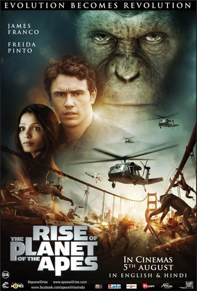
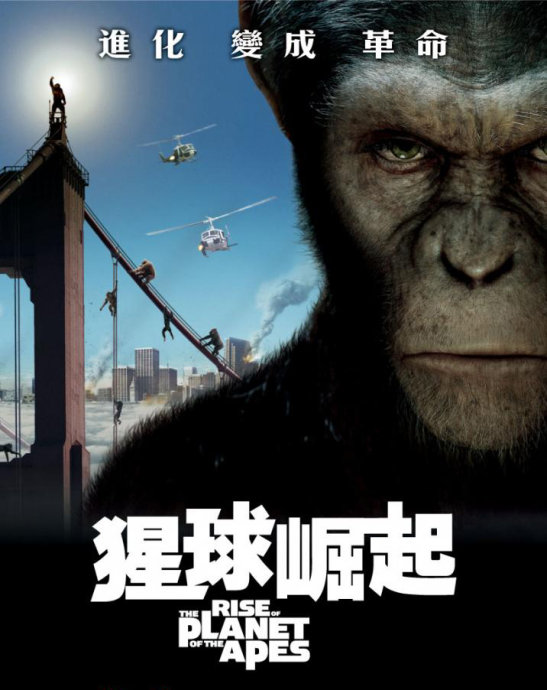
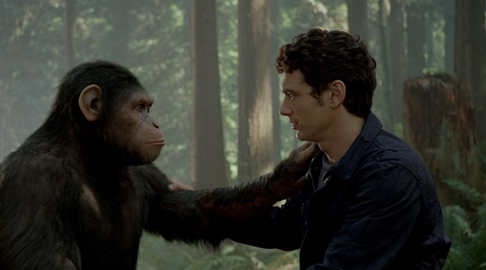

《猩球崛起 Rise of the Planet of the Apes》

			

老公的评论：

　　没想到这部电影是一部讲述温情的电影，不仅有人与人之间的感情、人与动物之间的感情，也有动物与动物之间的感情。
 

　　故事的起因并不稀奇，又是什么人类所搞的生化试验导致了动物的异常进化，但这部电影的重点却在于讲述一切的本源——人类给了猩猩他们所不应该拥有的智商，那么他们就要寻找自己的家园。
 
　　这部电影被定义为《人猿星球》的前传着实把我晃点了一下，结果两部电影的表现方式和主题完全不同，真够可以的！
 

　　老婆大人在前一段时间因为哥伦布的关系得出了一个结论，所有的科学家都是我们生存空间的“破坏者”——在这部电影中又得到了证实。
 
　　这部电影是一部好看的电影，但是不知道为什么在看过之后总是觉得有一点失望，看过的朋友给我个提示吧！

老婆的评论：
 

　　我很喜欢这部影片，更喜欢这部影片的结尾，猩猩凯撒变成猩领导了，他已经带领猩猩们通过与人类的战争来到了森林。连威尔来找他回家，他都说凯撒已经在家了，多么聪明和有原则！
 

　　看的书和影视作品越多，我就越觉得这些科学家们都是一些自私的人。说全部科学家都为了自己的名和利在研究各种伤害这个世界的生化药物或者武器，可能有点过。如本片中人类威尔为了研究一种病毒治疗他的父亲这类的病，而伤害着黑猩猩。所以当黑猩猩去报复医药公司，我挺高兴的。还有当他们不去救那个医药公司的头头并把他推到河里时，我笑了。
 

　　影片的风格挺简单的，有些动画片的风格，再加上人与猩猩之间赋予的感情，其实这些都是挺好的，唯独不好的是，人的私心太大了。
 

　　当凯撒被关进动物收养所时，他在他的小笼子墙上画上他家的小窗户时，多令人感动。是收养所的管理员，还有威尔不及时把他带回家，造成最后的结果。

 
上映年份
2011							
		
http://blog.sina.com.cn/s/blog_52187ba90100y47r.html
