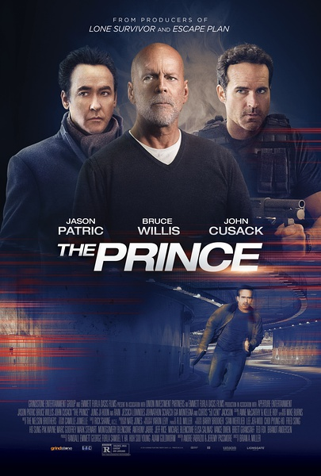
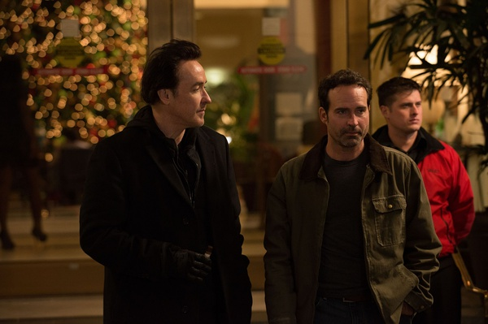

《王子 The Prince》

			

老公的评论：

　　开始看的时候，觉得剧情和名字对不上，后来才发现，还是挺酷的。

　　同样是孤胆英雄的题材，这部《王子》的好看程度远远超过了《猎鹰突起》，很难说是为什么，要说打斗，还是《猎鹰突起》更激烈一些，但是《王子》让我觉得更有吸引力。

　　应该说这就是耍酷的效果吧。

　　主人公平实的外表，不是绝对强壮的身材，反而衬托出“地狱王子”的反差，让我觉得他更酷了。

　　不知道这部电影算大成本还是小成本，有布鲁斯·威利斯，算巨星吧，而且他演的是个没什么胆量面对仇人的家伙，有点毁形象。

　　另外，虽然Rain曾经一度是老婆大人的偶像，但是在这部电影里的角色实在是有点二。

　　这部电影不错，节奏很快，剧情也不复杂，爆米花，好美……

老婆的评论：

　　如果说这也是一部讲孤胆英雄的电影，那相比之前看的同样是讲孤胆英雄《猎鹰突起》，这部剧在剧情方面讲究多了，整个电影精彩多了。

　　哎，不得不感触一下，为救孩子父母真的会拼命的，假如你不够强悍，千万不要做这种事情。你看王子就是这样的，对方什么势力，不还是要被灭。虽然是王子先错杀了对方的孩子和老婆，但为什么我并没有特同情他们？这算不算主角情结？

　　布鲁斯威利斯在这边电影里出场时间并不多，没什么可说的。

　　Rain在这部电影的扮相，我刚开始都不敢认。

　　总体来说，我觉得这部电影挺好看的，可我看豆瓣的评分这么低，有点难理解，只能说众口难调啊。

上映年份 2014							
		
http://blog.sina.com.cn/s/blog_52187ba90102vp4i.html
