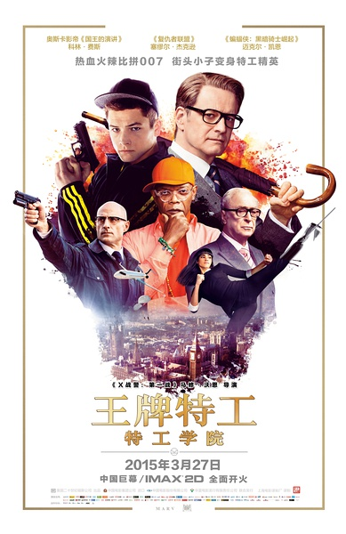
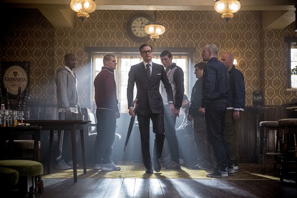
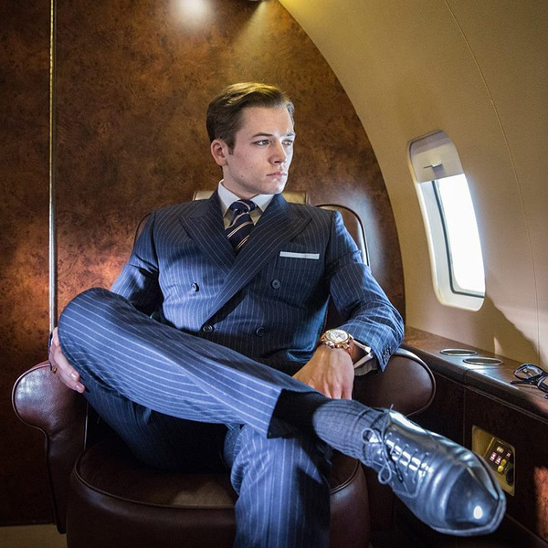
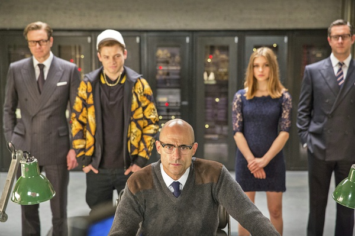

《王牌特工：特工学院  Kingsman: The Secret Service》

			

老公的评论：

　　我对这部电影的基本评价是：可看，但没有传说中那么好看！

　　说它可看，是这部电影塑造里一个属于它自己的完整的世界，不用考虑与真正的现实接轨，不用考虑真正的逻辑性，而且，打斗的场面还不错。

　　说它没那么好看，大概是因为华英雄向我推荐了两次这部电影，提高了我的锚定点，所以，当真的观看的时候，反倒觉得没那么出彩了。

　　这个电影不能说没有科幻的题材，但是还是无法把它算到科幻电影的范畴里，现如今的电影圈，我只对科幻电影的内涵有所期待，对于动作型的电影，我觉得能让我坚持看完的都是好电影，所以，《王牌特工：特工学院》能在紧张的节奏里让我看完，我觉得它就没什么不好。

　　但是我真的也夸不出什么……

　　萨缪尔·杰克逊在这部电影里好像瘦了许多，不过倒是显得年轻了，算是让我觉得有点意外吧。哈哈，其实写不出太多影评的另一个原因，是动作片真没什么好写的，写多了剧透，还是自己去看吧！

　　对了，最后补一句，免费的通信和互联网——这真的是个要命的概念！

老婆的评论：

　　前两天忘了写这部电影的影评了。

　　个人认为这部电影拍的非常的怀旧，有点像很多年前看的英式老牌特工的感觉。

　　艾格整天无所事事，和小伙伴们闯祸后，想起了哈里给的徽章和电话，哈里帮他把麻烦给解决了，还把他带到了特工学校，在特工学校他以优异的成绩留到最后阶段，因为不想杀了自己的小狗又被淘汰出局。

　　瓦伦丁是一个有反社会人格的大富豪，他的梦想就是杀死很多人类，他给他的合作伙伴脑袋里装上炸弹，很变态。他的助手的脚是机械的，而且还是武器，很厉害。

　　就艾格和梅林杀入虎穴，最后杀了瓦伦丁阻止了阴谋。

　　整体来说这部电影值得一看。

换一种打扮就像换了一个人

上映年份 2014							
		
http://blog.sina.com.cn/s/blog_52187ba90102vumb.html
