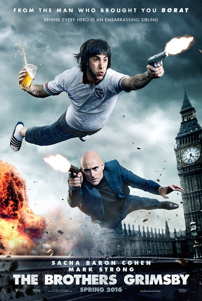
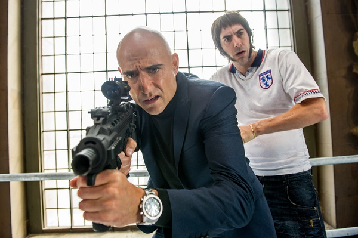

《王牌贱谍：格林斯比 The Brothers Grimsby》

			

老公的评论：

　　我真的没法说这是一部好电影，里面的恶俗桥段太多了，并且这些桥段在我看来，其实并不搞笑。能把这部电影坚持看完，主要是我想看看英国神戏能够“神”到什么地步。

　　看过这部电影，我的第一感觉是：原来我们的各种神剧、狗血剧情其实也不算很过分，西方也有这样的电影，我们平时看到的少，只是因为我们比较挑剔，所以，那些中国的神导演、神编剧也许并”不是很差“，也许还处于世界领先地位呢。

　　我认为有人拍这样的电影，有人买票去看这样的电影，只能说明一个问题：这个世界上我不懂得文化还有很多很多……

　　当然，作为一部没有下限的喜剧，这部电影也不是没有有趣的笑点：比如两个彩蛋——并不是每个特工都会很自然的团灭了接应队友而觉得自己很英勇，也不是每个特工都会杀掉路人甲的……

　　不想评价更多，喜欢无下限恶搞的可以去看看……

老婆的评论：

　　说实话，我不是很喜欢这部电影，我想大概因为这部电影不是我的“菜”，虽然其搞笑的部分真搞笑，可是恶俗的部分也是真恶俗，还有电影里面的人物形象有点不想常人。

　　从剧情方面来说，就是一个哥哥诺曼（萨莎·拜伦·科恩饰）寻到了那个被别人领养了走的弟弟后来成为塞巴斯蒂安（马克·斯特朗饰）特工，在不正确的地点用了不正确的见面方式，导致后来发生的系列搞笑有荒唐的事件。

　　最搞笑的部分是诺曼成为特工后的事情，他问个路就能以防止泄露秘密杀人，上船见队员把队友都给杀了。

　　温馨的部分也是有的，哥哥和弟弟小时那段故事也是挺感人的。

　　要是MI6秘密特工都是诺曼那种型，我很怀疑这个组织还存在多久。

上映年份：2016							
		
http://blog.sina.com.cn/s/blog_52187ba90102x0nz.html
