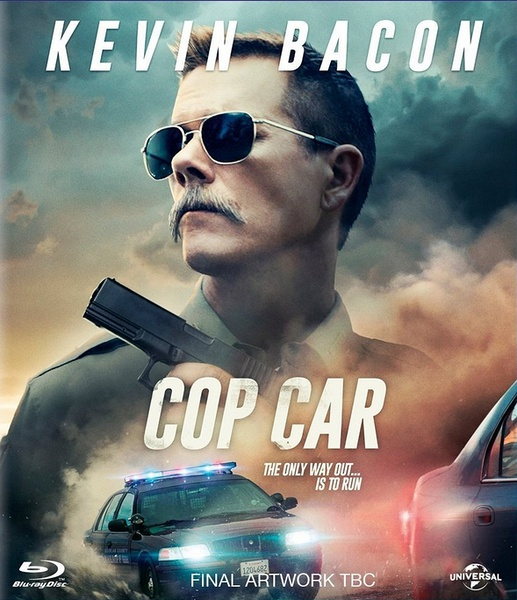
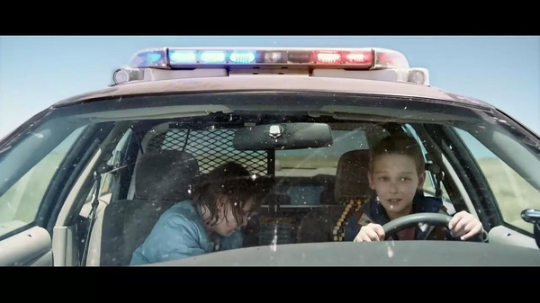
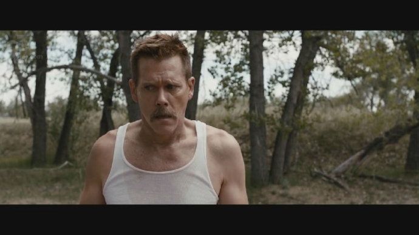

《玩命警车 Cop Car》

			

老公的评论：
 
　　古龙云：人的名字可以起错，但是外号却不会叫错。一部好的电影显然不是这样，一部好的电影连名字都不应该叫错。
 

　　看这部电影，是因为《玩命警车》看上去像是一部很酷的警匪电影，而且里面的警察应该为了正义很暴力，而且打斗应该非常激烈，但是事实显然不是这样，这部故事的打斗不但不激烈，而且除了一些个别血腥的场面之外，这更像是一部儿童电影——对小朋友很有教育意义。
 

　　贝肯是个老熟人了，里面的老太太也在《疑犯追踪》里出演过，她的体态给我们留下了深刻的印象，所以，有熟人的电影总是会显得好看一点。
 

　　这部电影的制作手法很简单，像是个小成本，但是说实话，情节一环扣一环，让我们忍不住就看完了，还是有点意思的。我觉得故事处理最好的地方就是在于一些细节被忽略不计了：比如两个小朋友为什么要离家出走，为什么一路飙脏话，警长为什么埋尸体，最后小朋友得救了没有……，这些完全可以由观众脑补，这样的好处就是节省出篇幅来描述主题，而且避免了一些细节不严谨带来的负面口碑，真的不错！
 
　　不激烈，说不上好看不好看，但是不知不觉就看完了的电影。

老婆的评论：

 
　　参与的演员加起来就5人，场景少，没有特效，看上去像个小成本电影，但看起来还是不错的，甚至某些时候我还挺激动。
 

　　额，要说一下，这里面我们看过其中2个演员的影视作品，是不是说明我们现在看的片子很多，还是说明这部电影比想象的投入要多些。
 

　　这部电影教小朋友，别动不动就离家出走，你们还太小，等翅膀硬了再飞，另一个道理，好奇会害死猫，小朋友别对什么都好奇，停在路边的警车可千万别上去开，不然结果可能会不太好，你看，最后那个中枪的小朋友可能就活不了了。
 
　　哎，小朋友在警车里开枪时，我就想到了，他们可能会被误伤。
 
　　不过，说到底还是属于运气不好，这两个小朋友无论如何都没有想到这警车的主人，是黑警，不然他们也不会这么倒霉了。

 
上映年份　2015							
		
http://blog.sina.com.cn/s/blog_52187ba90102w67s.html
