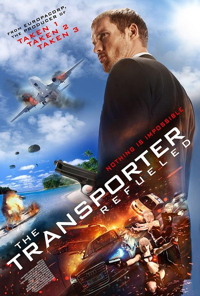

《玩命速递：重启之战 The Transporter Refueled》

			

老公的评论：

　　事实上，这部电影作为爆米花之作还是可看的，稀里糊涂地打完，稀里糊涂地结束，可看。

　　我觉得这部片子被外界评价不高的重要原因是：接棒斯坦森实在太难了！虽然我无法说斯坦森的每一部电影都是经典，但是《The
Transporter》系列是很难被别人超越的。

　　除了电影之外，我一直觉得《The
Transporter》系列是拍的最好的广告，比那些任何号称像大片的广告都强的太多，因为那些广告并没有真的拍成大片。我没有关注奥迪在这部电影中投入了多少钱，但是我觉得在目前电影圈都试图植入广告的时候，为什么没有人真的去好好策划一下“广告电影”呢！或许，就等着我来呢吧！

　　应该说，这个续集并没有拍出新的亮点来，所以，我觉得很难看到《The
Transporter》系列续集的续集了，不过，总会有新的题材、新的电影、新的演员冒出来，期待下一部吧……

老婆的评论：

　　整体来说，我觉得这部电影属于能看但还没有到好看的程度。

　　没想到是那四个女人就设计了这么一个大方案，还经常的只出现3个，藏1个在暗处，太厉害了。在某种程度上来说，有没有那个快递员弗兰克都是无所谓的，当然就缺少了车技表演了。

　　我觉得弗兰克的老爸太有范了，他一直说自己是一个销售代表，所以去了很多地方，但他被四个女人利用时，我看他可一点都不慌，反而还替她们客串一下角色，怎么都有特工的痕迹。

　　最后要是不是死了三个女人的话，那这个局就太完美了。

上映年份：2015							
		
http://blog.sina.com.cn/s/blog_52187ba90102wbu5.html
