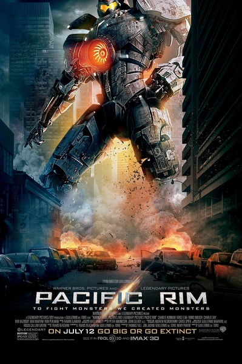
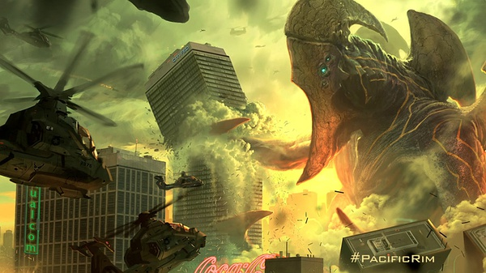
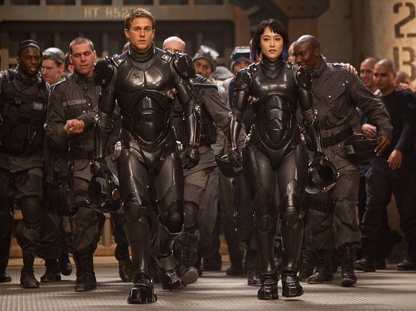

《环太平洋 Pacific Rim》

			

老公的评论：
 
　　听说这部电影的大名很久了，现在才看，觉得还是名实相符的。
 

　　这是一部日本风格很重的电影——科技人大战怪兽，说它日式，主要是里面的怪兽太日本化了，而那些地球人驾驶的大机器人，很像几十年前的“迈克逊一号”的感觉，还是个组合体。
 

　　对于这样的一部电影，其实演员是很难被记住的，看的就是大场面。整体来说，这部电影的特技恰到好处，没有过分的夸张，也没有不真实的感觉。
 

　　那些怪兽难道是外星人从海底就地取材，用海里的动物改造的吗？怎么那么结实，能够经得起机械的打击，太恐怖了。要是外星生物有这样的能力，那么我们真的是无法打败他们的。即使地球的裂口被封住了，他们也一定有办法打得开。
 

　　故事里有一点交代的不是很清楚——既然沿海地区容易遭受怪兽的攻击，为什么还有那么多居民生活呢，不是应该早就迁往内陆了吗？
 

　　龙·佩尔曼的那个角色的组织很有意思，我觉得他们有足够的资格就这个题材拍一部衍生剧了，唉，看见好看的电影总是希望能够改编成电视剧。

老婆的评论：
 
　　这是一个不能变形的变形金刚，你说是不是？
 

　　这种入侵的外星人实在是太强大了，就那么几个把地球搞得乌烟瘴气的，实在是太坏了。在海里出没还能飞，身材巨大，人类的武器对他们的影响不大，怎么办？只好弄几个不能变形的变形金刚来对付他们了。
 

　　想想，其实电影也没演什么，有几场打斗，还算精彩。有一个怪科学家把自己的脑子和外星怪物的脑子连接在一起，找到了真相，又有司令员的牺牲让尼克这组最终炸了外星人的入口。就这样一部影片，我还是觉得可看。

上映年份　2013							
		
http://blog.sina.com.cn/s/blog_52187ba90101e0jy.html
