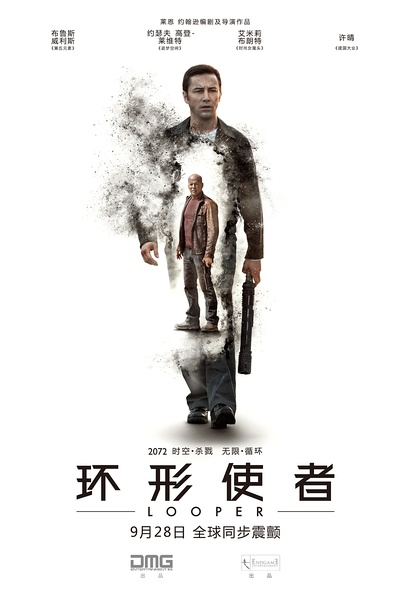
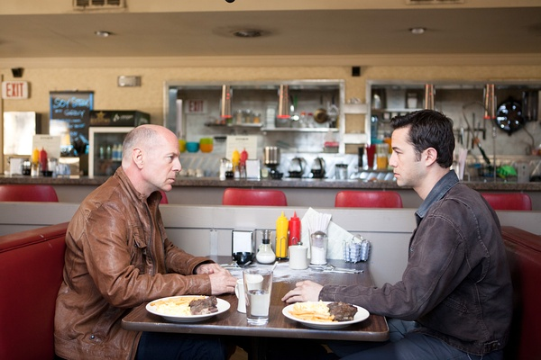

《环形使者 Looper》

			

老公的评论：
 

　　从一个酷爱科幻的人的角度来看，这部《环形使者》虽然没有太多的特接与超现代科技，但是其中却包含了一个关于科幻的非常重要的概念——不再谈“弑母理论”，而是讲杀了现在的他，未来的他会如何——其实可能依旧是个悖论吧，但总算是有了一点新意。
 

　　这部电影并没有太多的内涵，Joe自杀了，也不能保证那个小朋友未来就不变成“唤雨师”，所以，这样的电影实际上还是不需要我们想太多，只要跟着剧情走就可以了。
 

　　很久不去关注科幻小说了，我觉得这部电影如果写成小说的话会更好看一些，也省的在电影中用画外音来描述了，布鲁斯·威利斯是个看点，不过他真的老了。
 

　　感觉上这部电影并不需要把成本花在剧情上，我甚至怀疑时空机器是用一台洗衣机或者是一台水泥搅拌机改的，不过不影响故事的完整性。
 

　　这样的故事很有琢磨劲儿，想象一下，如果你知道自己和未来的自己处于同一时间当中，想给他留言，会在身上刻字吗？或者，换个思路，其实最后年轻的乔不一定要自杀，只要打坏自己握枪的右手也可以解决问题，唉，可他偏偏耍了回酷……

老婆的评论：
 

　　像这种在看的过程中需要思考的影片让我觉得复杂，其实一旦看到结尾揭露出来的东东，又让我觉得影片没那么复杂。本片中的那个环，随着年轻的主人公乔，杀死了未来的自己而结束，在结束时，我和老公都觉得结尾有点仓促，似乎交代的不够，也似乎是意犹未尽。
 
　　不过，总体来说，这部电影还是挺好看的。
 

　　时空旅行在未来是一件很容易的事情，但要杀人却没那么容易，原因很复杂，所以未来的人要解决掉某些人，都会被送至几十年前的现在，所以有不少人做了环形使者也就是杀手，这些人在指定的地点收到人，一枪就解决了，再一烧，真的很容易很简单，而且价钱也不错，但唯一的问题就是有可能杀了未来的自己。

上映年份 2012							
		
http://blog.sina.com.cn/s/blog_52187ba9010176sn.html
