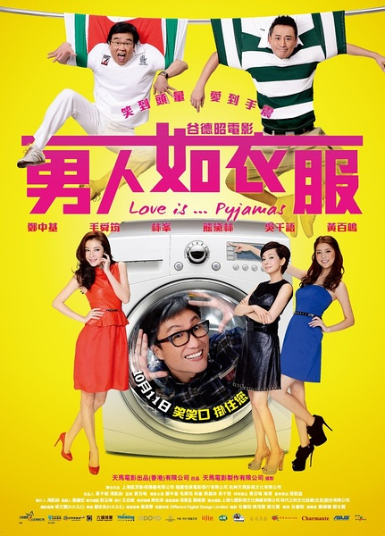

《男人如衣服》

			

老公的评论

 
　　最近看的港片都还不错，这部喜剧《男人如衣服》不是很恶搞，但是笑点很足，很港！
 

　　林峰是大人最喜欢的男星，不过这次演的是一个有点憨的万人迷，还挺有意思的；郑中基是我认为的现在港片中唯一真正的谐星，熊黛林略有些装嫩的感觉，显得有些贫气，底蕴不足；毛舜筠有些老了，怎么像宋丹丹？黄百鸣，很本色，我甚至觉得第一次看他的喜剧的时候他就是这种感觉，除了时间的痕迹，别的变化基本上没有；吴千语侧脸真的像极了杨千嬅，正脸儿却完全不同，真有意思；海青不是很熟悉，但感觉在片中比较到位，演员中，另一个看点就是里面有许多周星驰电影中的配角出现，算是很怀旧吧！
 

　　这部电影是讲感情的，确切地说是爱情，幸运万人迷的爱情，高智商梦想男的爱情，寡居时怀念亡夫的爱情，千里姻缘分合边缘的爱情……，个人觉得余春天对其前夫的感情最感人，不知道大家以为呢？

老婆的评论：
 
　　这种电影一点内涵都没有，看完感觉乐的时候笑笑，看完了就完了，也终于有人把男人比喻成衣服了。
 
　　郑中基都这么老了，还要演年轻人，也真难为他了。
 

　　林峰演一个这样的形象，也有点颠覆了他塑造已久憨厚、酷的影视形象。让我有点想不到，最重要的是他是我最喜欢的男星之一。所以，有点不喜欢把他形象变成搞笑的那种角色。
 
　　毛舜筠现在怎么像宋丹丹了，呵呵！
 
上映年份 2012							
		
http://blog.sina.com.cn/s/blog_52187ba901019l4s.html
