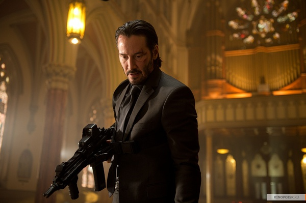

《疾速追杀 John Wick》

			

老公的评论：

　　发现有很多电影，国外的片名只是主人公的姓名，但是翻译成中文之后就会变成另一个名字，同样也是另一个意思。这部电影翻译成《疾速追杀》还算是基本切题。

　　看的时候，和老婆大人一起讨论这部片子是不是有点像前不久看过的《王子》，后来一致认定这部电影要比《王子》更酷，更好看一些。

　　喜欢这部电影倒不是因为我有多喜欢基努·里维斯，相对于《黑客帝国》，我们两个可能喜欢《康斯坦丁》更多一些，因为我们更喜欢灵异的题材。《康斯坦丁》被拍成连续剧了，我个人觉得这个《疾速追杀》也可以被改编成一部美剧。

　　故事中的“金币系统”很有趣，虽然电影没有直接的交代，但是随着剧情的发展，我们基本看懂了金币的用途，好像是在John
Wick所生存的环境中，金币是一种专门的货币，像是一种令牌，持有令牌的人可以让系统内部的人员协助做一些事情，就这个情节，就够拍一部好看的美剧了——虽然不完全相同，但这让我想起了《侠客行》中摩天居士谢烟客的“报恩令”。

　　另外，神秘酒店的“管理层”也是一个非常有趣的系统设置，如果John
Wick的对手是这家酒店，会不会情节更紧张激烈呢？

　　Marcus的死有些遗憾，不过这也给了John
Wick杀回来解决一切的理由，只是最后他为什么要刺自己一刀呢？

　　有个电影留的悬念很烂，但《疾速追杀》中没有直接描述清楚的事情却让我想了很多可能的场景，自己补足了一部更长的电影……

老婆的评论：

　　我很喜欢这部电影，够酷！看的时候很刺激！

　　约翰的妻子刚刚去世，为了让他不那么孤独和难受，妻子留给他一条小狗，约翰有了寄托。然而，他的车被俄罗斯黑社会维戈的儿子看上了，结果带人到他家抢了他的车，杀了他的小狗。

　　约翰什么都没说，把埋在家里的装备拿出来，开始追杀维戈的儿子。

　　所以说，天天有天，人外有人，不是什么人都可以欺负的，而且事情不要做过了，或者，当时直接杀了约翰也是一种很好的处理方式。可惜，维戈的儿子不懂，为此付出了生命的代价，还连累到维戈，当然也怪维戈自己，以约翰当时的脾气并没想杀他的。

　　这个影片里塑造的杀手规则，很有意思，我第一次看到影视作品中，规划出来的杀手世界定的那个规则，我想金币可能是杀手世界流通的货币，金币可以在其酒店使用，可以召唤清道夫，也可以治疗，而到了这个酒店，杀手不能破坏规则，否则领导层不高兴后果很严重。

　　看，不是所有人都是为了钱就可以出卖自己的朋友，这里的老杀手不但没有去杀约翰还在后面保护他，挺有人情味的，很遗憾被维戈杀了。

上映年份 2014							
		
http://blog.sina.com.cn/s/blog_52187ba90102vtam.html
