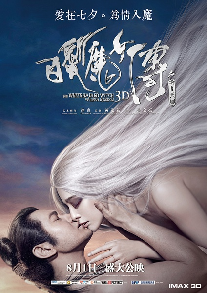
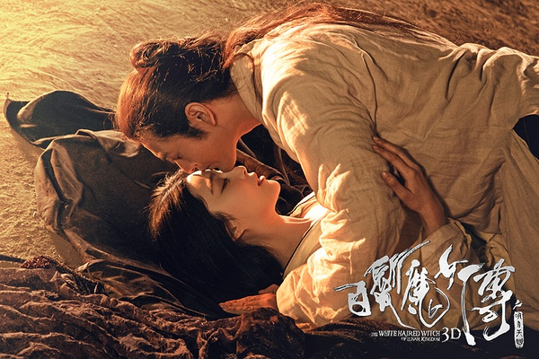
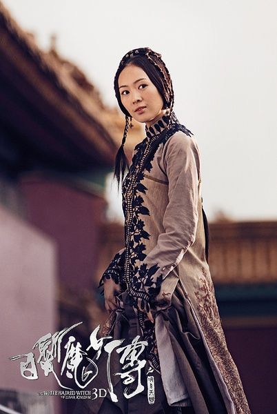
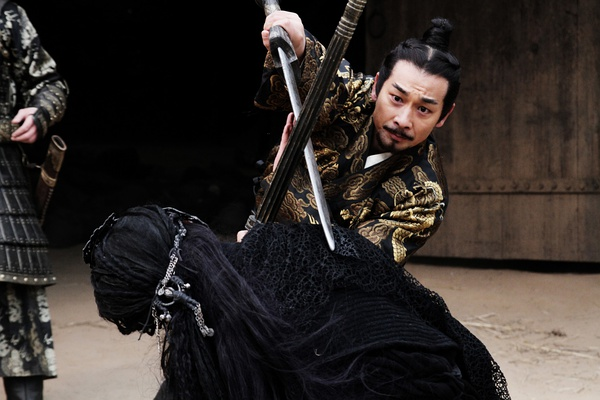

《白发魔女传之明月天国》

			

老公的评论：

　　对于深爱着武侠，甚至是非常喜欢梁羽生才子佳人风格武侠的我来说，这部电影真是把小说糟蹋的一无是处，所以对于这种严重篡改原著的影视作品，我无法从小说的角度来衡量，按照老规矩，当做同人吧。

　　我觉得很多事情不一定要喜欢，习惯了就好，比如我一直不怎么喜欢黄晓明在电影中的形象，最近看国产电影多了，也就习惯了，觉得没那么不舒服了，他饰演的卓一航在这部电影中虽然有点傻缺，但是考虑到编剧和导演的水平，也就只能这样了。

　　其实，范冰冰饰演的白发魔女的形象还是可以的，如果真的尊重原著拍一部《白发魔女传》，范冰冰饰演这个角色一定会满堂彩！

　　这部电影是最近看的国产影片中质量比较差的一部，具备了几乎所有国产电影的通病——转折太突然——比如卓一航说谎与说实话前后一共只有白发魔女挨揍的时间，编这个瞎话干嘛啊？只是糟践了原著中经典的形象。

　　《白发魔女传》被改编成电影也不是一次了，但在我看来，没有一次是成功的……

老婆的评论：

　　这种不是结局的结局看的挺没有感觉的。整个故事，剧情进展的慢，关于卓一航和练霓裳两人对话镜头太长，这样故事不可能太精彩。

　　我记得我已经看过《白发魔女传》的小说，可老公说我看的是之后的那么部，不过，就这部电影来讲，也无关紧要了，反正和原著差之千里。

　　童瑶乍一看还真以为是章子怡，我和老公还说，这部电影的阵容真的很庞大，多看了几眼，才看出来这个是传说中的小章子怡。

　　最后我想说，这部电影要是当一部爱情故事来看的话还行，两个相爱的人，在经历磨难后，双双掉下悬崖，结局怎么样，大家想就行了。

　　另外，我不太喜欢电影的彩蛋，演完就演完了，非要再最后给一个片段，像小说的番外。

多么像章子怡

上映年份　2015							
		
http://blog.sina.com.cn/s/blog_52187ba90102w4jw.html
