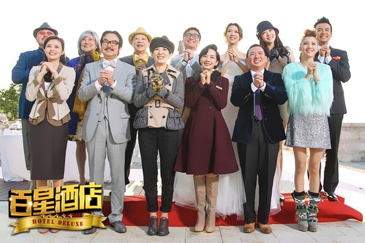
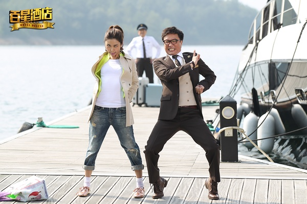
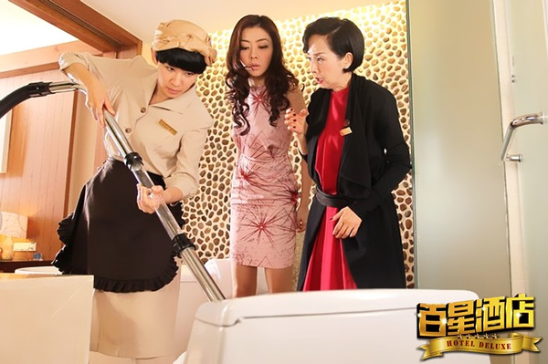

《百星酒店》

			

老公的评论：
 
　　有的电影有很多影星，但是看一会儿就看不下去了，有的电影虽然让人觉得很贫，但是你会一直把它看完，《百星酒店》就是后者。
 

　　贺岁喜剧是一个很传统的传统了，演员里面有黄百鸣、吴君如、毛舜筠、杜汶泽、郑中基也是很常见的那种常见了，故事的发生地点也很简单，都没有离开那个酒店的范围，但是，还值得笑一笑。
 

　　郑中基的喜剧天赋就不用多说了，薛凯琪也配合的还好，吴千语在查过资料后才知道她是林峰的女朋友，不知道是不是现在时了。熊黛林虽然一下子蹿红，但是好像出演的角色一直不怎么出彩。
 
　　有一些精彩的对白，但是现在已经不怎么喜欢看那种靠“恶心”来搞笑的桥段了，这点要是改进了就好了。
 
　　对于波的印象还停留在“萧十一郎”，不古装的他，显得挺憨的，哈！
 
　　不一定每一次都要汽车爆炸、警匪卧底，搞点小温馨、小浪漫，其实也挺好的！

老婆的评论：
 
　　就这种电影对我而言，就像麦当劳这类的快餐，可吃但没有吸引力。
 

　　我想编剧也很努力的想把电影拍的有意思，所以在语言方面也用了很多的冷幽默，对不起，我快把一台节目中的冷幽默的台词放这里了，我分心了，以上这段大家自觉屏蔽吧。
 
　　所以，我得出结论了，除了这部电影知道吴千语是林峰的女友，我好像没什么收获。

                                     
郑中基和薛凯琪的搞怪

上映年份　2013							
		
http://blog.sina.com.cn/s/blog_52187ba90101f6x7.html
