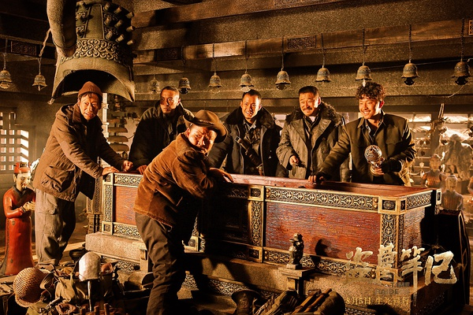

《盗墓笔记》

			

老公的评论：

　　客观评价，这部电影拍的还是不错的，魔幻感十足，特效处理的也合理且自然，并不比西方魔幻片差。

　　我并没有看过《盗墓笔记》的原著，在看过电影之后，更加不想去看原著了，这个故事并不是我喜欢的风格。

　　鹿晗的活泼在这部电影之中表现的十足，井柏然耍酷也耍的够不够的，没想到在电影中还看到了敖嘉年和姜皓文，TVB演员真的沦落到这种地步了？演这种配角？

　　我觉得这部电影好就好在和时尚气息的接轨——《盗墓笔记》小说有足够的受众群体，而电影的拍摄手法又足够“现代”，很接近现在的主流魔幻片拍摄手法——这样的电影如果真的能够走向世界，我觉得至少可以让更多的人知道中国的现在并不是只有农村和贫穷落后。

　　如果非要挑一下无法让我理解的地方的话，那么谁都会讲英语以及枪支的泛滥似乎有点“架空”的感觉了，其实这部分可以考虑的再周详一点。

　　总之，虽然并不喜欢《盗墓笔记》故事的世界观，但是这部电影还是很可看的。

老婆的评论：

　　这部电影有点看大片的感觉，不是指有多少明星上阵，而是在剧情上发展，墓里面的场景场面和在里面的剧情上的安排。

　　很遗憾不知道张起灵（井柏然饰）已死，在我看来，他应该就是守墓人，而目的就是不要让墓地的人走出来。

　　刚开始的时候，当吴邪（鹿晗饰）这一队盗墓人和另一队遇上时，我还想两队打了的挺激烈的，怎么就把另一份杀死呢，后来看这是有目的的，就是让他们放下个人利益，拯救人类。

　　我很怀疑蛇母其实是外星生物，就墓里面呈现的场面，怎么也不想千年前的科技能达到的。

　　吴邪的驱虫术很厉害。

　　在我看来，就国产电影而言，这部电影拍得不错。只是在看电影的时候，我常常分不出，电影的背景是哪个年代发生的事情。

上映年份：2016							
		
http://blog.sina.com.cn/s/blog_52187ba90102x0vs.html
