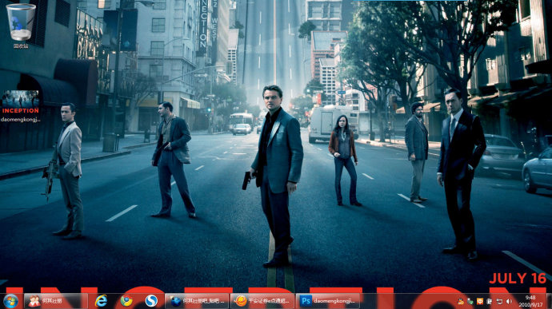
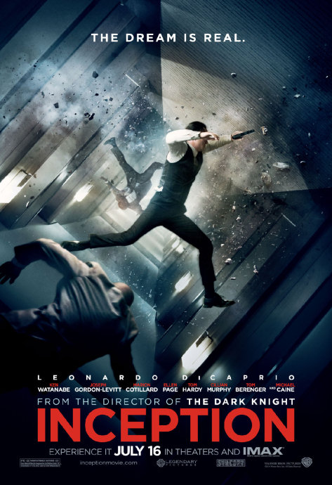

《盗梦空间 Inception》

			【夫妻影评】《盗梦空间 Inception》

老公的评论：
 
　　这部电影，我没有看完，看着看着突然有了很重的想睡觉的感觉，还不如我看老剧集《神探阿蒙》来精神。
 

　　对于《盗梦空间》我是把他归入视觉效果大片分类的，因为从创意的角度来看，这部电影的设计并不算很新，而且，当我看到主人公们试图通过多层梦境去植入一些思想概念的时候，我的第一反应是催眠。既然要写这些超现实概念，用催眠这么简单就可以完成的事情，有必要搞的那么复杂吗？
 

　　看到一些网络上的评论，有相当一部分朋友因为这部电影队心理学开始感兴趣了，从这一点来说，我很佩服编剧和导演，因为——电影都是拍给没看过的人看的，而随着岁月的变迁，总有一些人会是刚刚开始接触科幻，接触心理学，接触大片，我没有太过激动于这部电影剧情，可能正是老了的标志。
 
　　说回电影本身，其中的视觉效果还是很值得一看的，会给人一种似曾相识的感觉，而这种感觉本身就与梦境无异。
 

　　至于说到电影想讲述的，是那些主角们分不清梦境与现实，我觉得这个概念略有一些牵强，工作就是工作，不可能说一个演员扮演过杀手，他就分不清自己是杀手还是个演员了，只能入戏，不能出戏，只能说那些工作人员的素质还不过硬，呵呵。
 

　　刚好最近给老婆大人讲了“庄生晓梦迷蝴蝶”的内涵，她觉得古人真的很厉害，在那个年代就有了《盗梦空间》的雏形了！我觉得说的很有趣。
 
　　或许是最近要思考的东西比较多，所以觉得这种把简单的事情搞的很复杂的电影失去了味道，也许过一段，我会重新爱上这部电影。
 

老婆的评论：
 

　　你有没有做过什么很难忘记的梦？在醒来以后你还想回到那个梦中的世界？我感触柯布的妻子玛尔，她已经分布清楚哪个是梦哪个是真实生活？我也怀疑柯布他对现实与梦境的理解。电影里最终究竟是谁活在现实？我还在猜测！
 

　　这部电影实在是太火了，媒体的评论特别的多，各种深度的评论，让我感叹半天，为什么我看电影的时候，没有这种深度？这部电影给我最大的想法就是当一个筑梦师很不错，就像自己规划了一个世界，在这个世界里我可以主宰一切，这种快乐我想很多人都想要吧。其实电影本身又有什么呢？人还不是不是活在一种意识中？只是电影把人的意识拔高了几层而已，一层和两层又有什么关系？

　　
　　相对而言，我比老公更喜欢这部影片。当然，我并没有觉得这部影片在科幻的世界里有新的突破，他只是用高科技的手段把梦的世界弄的非常有视觉的冲击力。不管怎么说。我觉得这部影片还能看，特效不错，主演也还可以。

上映年份
2010
 
导演克里斯托弗·诺兰
 
主演
莱昂纳多·迪卡普里奥
玛丽昂·歌迪							
		
http://blog.sina.com.cn/s/blog_52187ba90100olml.html
