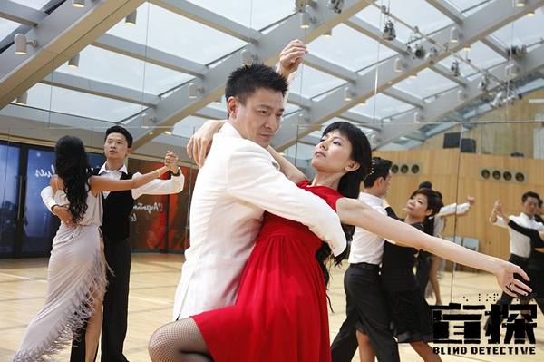
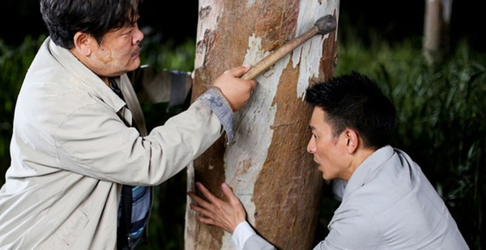

《盲探》

			

老公的评论：
 

　　一直相信如今的刘德华是不会随便接手烂片的，纵然不是太好，但是也不会太差。看过这部电影之后，虽然不是觉得很烂，但是确实觉得刘德华很颠覆。
 

　　看到《盲探》这个片名，看到刘德华是主要演员，觉得电影中的盲探应该是个很优雅的角色形象，结果，呵呵，角色不仅不够优雅，还很有些狂躁。
 

　　没有大场景，是个小故事，这就是我对这个电影的整体印象，没有巨星风范，却有极冷幽默，这点也算是不错了，特别是盲探对于住到客户家中不另收费的那段，很有趣。
 

　　通过这部电影，以及我们看过的很多港剧，觉得港产文艺作品要是能够不老让演员扮年轻就好了，刘德华实话实说已经有些老态了，让他扮演一个四十岁的人，有些勉强，港片要克服这个缺点啊！
 
　　支持香港电影，加油！

老婆的评论：
 
　　没想到这部剧是这样的一个感觉，呵呵，淡淡的，有点冷幽默。
 
　　刘德华真是老了，这种老的状态，我想是这些明星们最不愿意面对的事情吧，再有钱也改变不了年华的流逝。
 
　　就这部影片本身，我觉得编的还行，可以看看的。

上映年份　2013							
		
http://blog.sina.com.cn/s/blog_52187ba90101eovp.html
