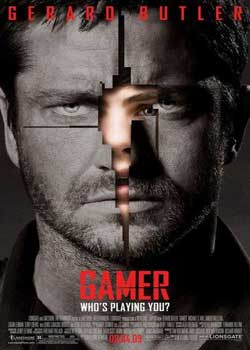

《真人游戏 Gamer》

			【夫妻影评】《真人游戏 Gamer》

老公的评论：
 
　　巴特勒是我比较喜欢的演员，而这部电影的精彩程度，也不算是让人失望。
 

　　游戏世界与现实世界接轨的电影有不少，从这一点来说，这个电影的创意算不上新，但如此突出动作而非理念什么的，又让这个电影有了一些自己独特的卖点。而电影的结尾虽然显得有些仓促，却也可以算是合情合理，总之是一部可看的电影。
 

　　挑一些毛病的话，我想说的是这部电影的节奏，感觉上这部电影想在短短的一个多小时时间里表达出所有的概念，显得很不完整，其实这是一个拍摄成连续剧的好题材，我觉得应该是一部不错的剧集。而这样才会让这个故事显得很饱满。
 

　　最近可能是欧美剧看多了，有点不大爱看电影了，觉得电影表现的东西不够多，不过，这也让我体会到拍一部电影的难处，编剧、导演们太厉害了，事实上，在那么短的时间里，要塑造人物形象，表达中心思想，制作刺激的场景，这一切本身就是不可能完成的任务，在此，向那些拍出电影的工作人员致敬。
 

　　电影看多了，有些不好看的，看过开头十几分钟，我就会很老婆大人放弃观看，所以，相信我们，只要是我们坚持看完的电影，就一定有它可看的一面。
 

老婆的评论：
 

　　类似这种影片似乎看过，一群死囚犯不断的搏斗，胜利的人可获得自由，不同的这些参与搏斗的死囚们是被电脑后面的真人控制着，这部影片相当的色情、血腥及暴力。
 

　　本以为20场的胜利就能换回自由的男主人公卡贝尔，真相并不是这样的，他只是被人控制的一个傀儡，在将要完成的游戏中，要被游戏的设计者肯·卡斯特弄死，在另一伙人的帮助下，游戏玩家西蒙放弃了控制卡贝尔，让卡贝尔用自己的能力去赢取战斗。
 

　　如果世界要变成电影中那边，游戏的真实人物被躲在电脑后面的操纵，这样的世界是什么样的？发人深省，那一定是一个可怕的社会。
 

　　主人公最终逃离了战场，而又在西蒙及媒体人的帮助下战胜了肯·卡斯特，直播的真相让这些深迷的人民醒悟了，最终社会被关闭了。
 
　　该片的主人公很值得同情，他一直被人利用，在药物的控制下他成了杀人犯，这让他赢得胜利后能冠以英雄。
 
上映年份2009
 
导演Mark Neveldine
Brian Taylor
 
主要演员Kable……Gerard
Butler							
		
http://blog.sina.com.cn/s/blog_52187ba90100kpzy.html
