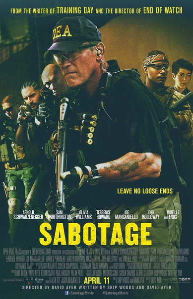
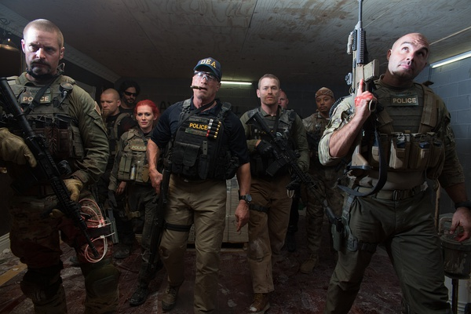
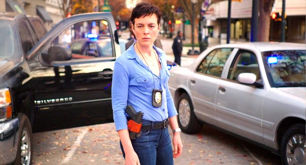

《破坏者 Sabotage》

			

老公的评论：

　　看完这部电影，我的第一句评价是：这部片子不是阿诺演也没问题。老婆大人表示了首肯。

　　我其实弄不懂为什么这些年近七十的老人家还要出来演这样的电影，我的意思是非要扮演一个和他的年纪很不相衬的人。

　　昨天还和华英雄聊起了阿诺，他的电影我基本都是在电影院看的，相比较起来，我觉得阿诺的电影整体评分要高于史泰龙的。不过这部电影让我觉得当两个人都老了的时候，史泰龙的《敢死队3》要强于《破坏者》。

　　在这部电影之中，并没有绝对的正派或反派，最近看的电影电视剧里有关黑警的题材实在是太多了，《破坏者》又是这样的背景设置，难道警匪电影真的没有新花样了吗？

　　这部电影还是挺血腥的，恐怖倒不恐怖，只是很血腥，而且满片都是粗口，估计是不适合小朋友看的。

　　还是不禁想起了从前，想起了阿诺的《过关斩将》，我记得是和大亮还有祝畅一起看的，不知道是我的记忆被操纵了，还是这个组合真的很奇怪。

老婆的评论：

　　这简直就是一个复仇者的游戏，在杀妻和杀子仇恨的阴影下，队长John要报仇，他需要钱，在某次缉毒行动中，他带领队员抢了一千万，当他们去取钱时，钱没有了，导致他们小队被调查，队员之间的信任也不再存在。

　　小队的队员一个一个的被消灭，我和老公一直在猜到底是谁在杀他们呢？刚开始的时候我想有可能是贩毒集团，随着联邦探员卡洛琳的调查，我想应该是属于自己人在做这个事情，还以为是那个拿到钱的人把队友杀了省事，挨个猜来着，怎么也没想到是Lizzy和Sugar合伙干的呢，她只是不高兴别人拿着钱。

　　最终John干掉了杀他妻子孩子的人，自己也受伤了，应该也活不了吧。

　　其实这部电影是不是阿诺演的都没有关系，可能换其他人更好点，因为阿诺真的有点老了。

　　这部电影不好的地方就是脏话特别的多。其他的还是不错，可以一看。

上映年份 2014							
		
http://blog.sina.com.cn/s/blog_52187ba90102vdir.html
