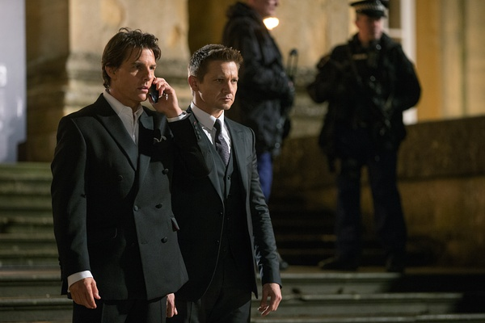

《碟中谍5 Mission: Impossible - Rogue Nation》

			

老公的评论：

　　在查过资料之后，第一个感叹的话题是瑞贝卡·弗格森居然是83年的人，可是为什么和62年的阿汤哥演对手戏看不出差着辈分？汤姆·克鲁斯真的是老了，主要老在了两腮的肉上，这让他整个的酷帅消失不见了，而多了一份大叔感。整部电影之中，只有摩托追逐的那段戏依稀见到了阿汤哥年轻时的影子。

　　杰瑞米·雷纳是一个长得很有特点的演员，算不上很帅，但是很禁看，而且让人看过一眼就会记住。他在这部电影中虽然没有什么表现身手的机会，但是他那件简单到极致的上衣实在是让我羡慕不已。

　　电影中的中情局局长在最后把自己的失误解释成保护卧底的策略，解释的太巧妙了，我觉得很多电影都会挖坑儿，但是这个故事很注重细节，挖下的坑儿填的很圆满。

　　看这部电影的时候，我在想，如果《碟中谍》还要再拍续集的话，是不是可以让阿汤哥从外勤动作型转变成指挥智慧型，让新人来完成动作执行的部分，那也许是另一种风味了。

　　好看的电影不多了，这部《碟中谍5》虽然算不上多好看，但是肯定不难看，这样的片子实在应该珍惜，希望编剧、导演、演员们都爱惜一下自己的羽毛，不要毁了自己创造的品牌形象。

老婆的评论：

　　要怎么说呢，这部电影，其实我是有期待的，但是结果是让我失望了，我觉得这部电影，没有创新的感觉。

　　间谍组织成为反派人物的时候，是多好可怕的事情，就如这部电影里的“辛迪加”，他们太知道政府的漏洞了，要不是伊森·亨特（汤姆·克鲁斯饰）的执着，我想笑道最后的应该就是“辛迪加”了。

　　当然这也是正义必胜的终极道理。

　　至于故事的情节，真没什么可以拿来说的。

　　应该说，那段摩托车追逐战还是挺酷的。

　　我看演员表发现张静初的名称，看电影时我还真没留意到她。

瑞贝卡·弗格森

上映年份　2015							
		
http://blog.sina.com.cn/s/blog_52187ba90102w3s5.html
