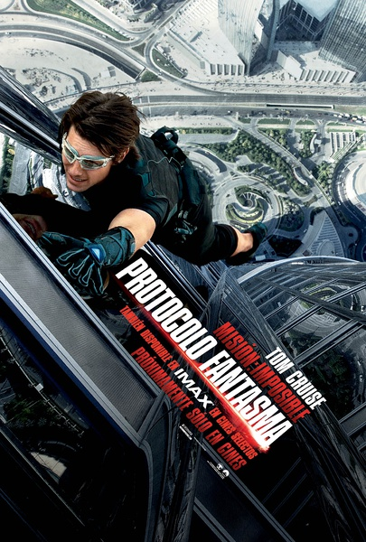
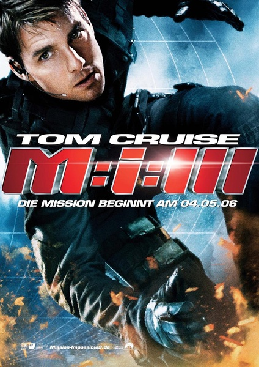

《碟中谍全四部》

			

 
老公的评论：
 

　　因为要看这一部，所以一口气把之前的三部都找来看了一下，发现除了主人公都叫伊森之外，这四部电影并没有什么必然的联系。最为搞笑的一点是不知道是什么样的高人在这部电影刚引入中国的时候给起了“碟中谍”这个名字，看起来和后边的剧情没有丝毫联系。
 

　　整体看起来，这四部电影最没意思的就是第二部，最后怎么变成两个人单挑了，有点傻，给人一种不动脑子的动作片的感觉，充分体现了港片没落，吴宇森是一位得过很多荣誉的导演，但他的这部电影，真的显得差了不是一点半点。
 

　　整个碟中谍电影很喜欢戴各种面具化装，挺有意思的，不知道真正的美国情报人员是不是都这么干的，哈，以克鲁斯的身高，要找到他每次化装都可以扮的很像的人也是个难题吧，他毕竟是个矮个的帅哥。
 
　　有很多人挑这个系列电影的硬伤，挑了这个那个，其实最有意思的应该是上海街头的枪战吧，这才是最虚构，最硬伤的事情。
 

　　说到最新的这部幽灵协议，其实还有点创意，毕竟是把俄罗斯最标志的建筑都给炸了，而且让美国高官死在了俄罗斯的领土上，挺不错，越来越有007的感觉了，只是，有点说不出的超现实的老旧感。
 

　　对克鲁斯没有什么特殊的感觉，所以对他的电影也没有特别的喜爱，但是对这个系列电影的第一部印象还是很深刻的，特别是伊森的一句“JOB知道”，我到现在还对当时电影的画面记忆非常深刻。
 
　　《幽灵协议》是一部可看的电影，里面的全息影象技术非常科幻，很有意思。

 
老婆的评论：
 

　　为了看《碟中谍》4，因为我的记性不得不重温前三部，虽然感觉不需要，因为片子之间并没有太大的衔接，不过这样也好，再看一次也不错，除了觉得第二部差点意思，其他的两部现在看来都不错。
 
　　其实在写这些时，我已经把这些片子忘得差不多了，呵呵，我的选择性记忆够选择的吧！
 

　　当然从整体感觉上来说，我觉得第四部是我最喜欢的，因为不管是从电影的视觉效果或者是电影的情节来说都贴近这个时代，而且里面的高科技还是动作的刺激程度有点意思的。那么在这里我就重点写写第四部吧。
 

　　对特工伊桑·亨特（汤姆·克鲁斯饰）来说，有没有不可完成的任务？除了不得不离开他妻子，其他的一切都在他的掌握中，当然离开他妻子又不是任务。所以对他来说是没有不可能完成的任务。那么止住一个毁灭性的导弹应该也不算什么难事了。
 

　　其实在某些方面我认同恐怖教授的一些观点，科学的进步最终是会导致地球的毁灭。只是我没有他那么消极到要自己先去炸掉地球而已。
 
　　看完这部电影，我说什么也不想去迪拜旅行了，万一遇到沙尘暴怎么办？这绝对是一恐怖景象。
 
　　不得不说的是汤姆·克鲁斯老了！

《碟中谍3》海报							
		
http://blog.sina.com.cn/s/blog_52187ba901011mcm.html
