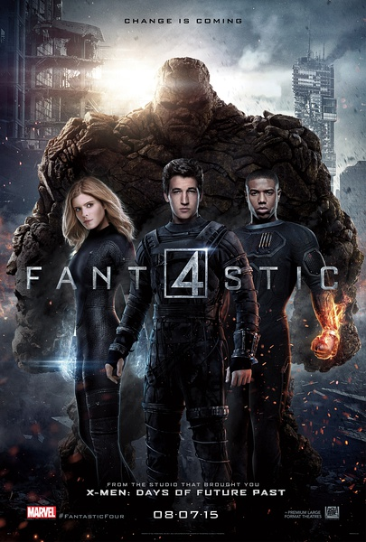
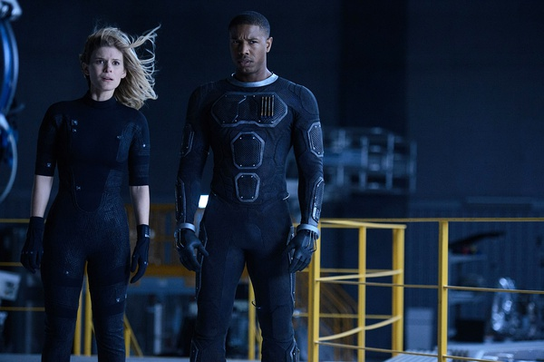
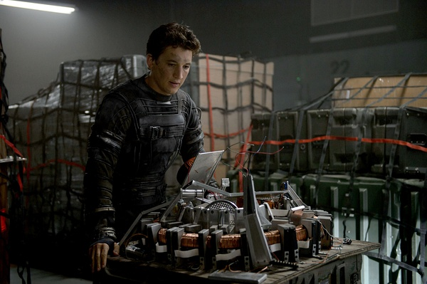

《神奇四侠 Fantastic Four 2015》

			

老公的评论：

　　网上对这部电影的评价并不高，但是我觉得其实这部电影还是可以看的。当然，或许这是因为我没看过漫画吧，所以我可以把这部电影和前作区分来看，没必要正面对比，当做同人好了！

　　我想很多网友把这部电影评价的很烂的主要原因是因为故事的铺垫太长吧，我也觉得这部电影从主人公小时候演起没有必要，不过在电影的前半部分交代了一些科幻理论，特别是关于维度的通俗理解，还是挺值得琢磨一下的。

　　其实我觉得漫威的大部分故事并非科幻，而是披着科幻外衣的“神话故事”，所以也没必要太过要求什么，好看，能够流畅的看完就够了。

　　看看如今的国内电影票房市场，已经不知道什么电影好看、什么电影受欢迎了，所以，也无须太过在意什么，看看，练练听力，消磨时间，展开联想……，觉得不好看的地方脑补，就够了！

老婆的评论：

　　我以为这部电影该叫神奇四侠前传，都是讲神奇四侠的由来。

　　四侠中，如果让你选择的话，你想当哪一个？或者你想拥有哪种特能？我的话，选那个苏珊的那个特能，估计谁也不想选本那个土人了，为什么其他的人都可以是人形，而他不能？理查德，救我。

　　科技探索是要付出代价的，外星探索那更是了，一不小心把外星人招到地球会很要命的，你看，被感染的维克多，差点就毁灭了地球，就算现在没问题，未来维克多会不会再回来，还不定呢？

　　约翰尼有了新力量后，挺高兴的，虽然有可能被政府利用，那有什么关系呢？那么说本是不是有点倒霉了，看来交朋友要谨慎。最最重要的一点就是去外星或者其它维度更要谨慎，比入股市更有风险。

　　总体来说，这个故事挺好的，拍的也不错。

上映年份　2015							
		
http://blog.sina.com.cn/s/blog_52187ba90102w7kr.html
