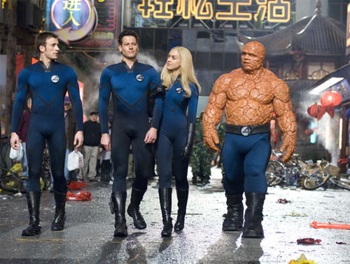

《神奇四侠　Fantastic Four》1＋2

			【夫妻影评】《神奇四侠　Fantastic Four》1＋2

老公的评论：
 
　　美国拍的这种电影，总是很有看头的，至少我们两个都很喜欢。
 

　　不过，就像老婆大人说的那样，我们两个对于电影本身的喜欢没赶上我们对于新买的55英寸大电视的喜欢，在买了电视之后，是第一次看高清的电影，感觉无论从画面还是效果，都不同反响，老婆大人还特地把灯都关了，我也配合着把我的水族箱的灯关掉，啊，这才是生活，嘿嘿！
 

　　看完电影之后，我问老婆如果她可以选择，她会选择剧中的哪个人物，她回答是隐形人，而我却觉得火人要有趣的多，会飞真的是太让我向往了。
 
　　不是什么新电影了，相信很多朋友都看过的，但我们期盼着会有第三集！
 
　　哈哈，有了大电视，以后我们会更多地看电影了，高兴！
 

 
老婆的评论：
 
　　最近家里添了一个大电视，所以在看这部电影的时候特别的清楚，感觉很舒服。
 

　　第一部相对来说很简单，主要是交代神奇四侠的来历，和对抗一起曝光在外太空也赋予了超能力的邪恶博士维克多。正与邪取决于人的内心，当然，电影中总要有正和邪，主要才会好看。
 

　　第二部剧情的设计复杂一些了，加入了地球以外的力量另外一个星球要吞噬地球，而“银人”是他们的开路先锋，在四侠和邪恶博士一起对抗“银人”时，其实“银人”并不太坏，最后的坏蛋依然是邪恶博士。这次还加入了一些生活的情节，隐形人苏与橡皮人瑞德结婚小情节，让这部电影变得喜剧轻松多了。
 

　　看这两种电影的最大好处，就是特别的轻松，真的是不用思考，只要跟着电影的节奏走就好了，四侠中间的吵吵闹闹，也只是为了电影中起到某种感觉，在外敌当前时，他们一定能共同的战胜一切。有点遗憾的是石头人被他老婆给抛弃了。
 

 
上映年份
《神奇四侠　Fantastic Four》1　2005
《神奇四侠　Fantastic Four》2　2007
 
 
部分演员职员表导演……Tim
Story 
编剧…… Mark Frost
 
 
Reed……Alex Hyde-White
瑞德……阿莱克斯·海德怀特

Sue……Rebecca Staab
苏……瑞贝·卡斯塔布

Ben……Michael Bailey Smith
本……迈克尔·拜利·史密斯

Johnny……Jay Underwood
强尼……杰·安德伍德

Victor……Joseph Culp
维克特……约塞芬·卡尔普							
		
http://blog.sina.com.cn/s/blog_52187ba90100g9e1.html
